# Architecture

## 시스템 한 줄 설명

무역문서 AI, 구조화된 시장 시나리오, 결정론적 현금흐름 엔진, 헤지 후보 탐색,
공식자료 상품 검색, 보고서 생성·검증 AI를 상태 기반 워크플로로 연결한
Human-in-the-loop 금융 리스크 관리 에이전트다.

이 시스템은 완전 자율형 멀티에이전트가 아니다. 단일 Streamlit 프로세스 안에서
`WorkflowOrchestrator`가 명시적인 순서·게이트·fallback·종료 조건을 통제하며, 각
Stage는 기존 함수와 adapter 계약을 사용한다.

## 전체 데이터 흐름

```mermaid
flowchart LR
    document[/무역문서 또는 데모 fixture/]
    intake["Stage 0 Intake"]
    confirm{사용자 확인 완료?}
    waiting([WAITING_FOR_USER])
    market["Stage 1 HTTP/File/Mock forecast adapter"]
    spot["Spot rate provider"]
    scenario["Model path + fixed stress builder"]
    cashflow["Stage 2 confirmed binding + Decimal cashflow"]
    hedge["Stage 3 Hedge candidates"]
    product["Stage 4 Official retrieval"]
    offline["Offline official KB"]
    draft["Stage 5 Report draft"]
    critic{Critic 통과?}
    revision["최대 한 번 재작성"]
    recheck{재검수 통과?}
    fallback["Deterministic report"]
    final([Final report and trace])

    document --> intake
    intake --> confirm
    confirm -->|"No"| waiting
    confirm -->|"Yes"| market
    spot --> scenario
    market --> scenario
    market -.->|"Disclosed fallback"| scenario
    scenario --> cashflow
    cashflow --> hedge
    hedge --> product
    product --> draft
    product -.->|"Web failure"| offline
    offline --> draft
    product -.->|"No official candidates"| fallback
    draft --> critic
    draft -.->|"API failure"| fallback
    critic -->|"Pass"| final
    critic -->|"Fail"| revision
    revision --> recheck
    recheck -->|"Pass"| final
    recheck -->|"Fail"| fallback
    fallback --> final
```

`WorkflowState`는 Stage payload를 메모리와 Streamlit session state에 보관한다. 별도의
DB는 없다. `TraceEvent`에는 Stage payload, 문서 원문, 확정 금액, API key를 넣지 않고
case ID, 상태, 시간, provider, retry, fallback, 근거 참조 경로, 경고만 기록한다.

## Stage 0~5 실제 실행 경로

| Stage | 실제 진입점 | 입력 | 구조화된 출력 |
|---|---|---|---|
| 0 Intake | `src/document_intake/extractor.py::extract_trade_document_with_metadata`, `confirmation.py::create_confirmation_record`, `validators.py::apply_deterministic_review_state` | 업로드 bytes 또는 demo fixture, 회사 역할·국가 | `TradeDocumentExtraction`, `ValidationResult`, `ConfirmationRecord` |
| Gate | `src/workflow/gates.py::confirmation_gate` | 추출, 확인 기록, 결정론 검증 | 허용 여부와 안전한 차단 사유 |
| 1 Market Risk | `WorkflowOrchestrator.run_market_risk` → `market_integration_service.py` | 팀 Stage 1 HTTP/file/mock, 별도 Spot, 결제일 | `MarketIntegrationResult`, `NormalizedScenarioSet` |
| 2 Cashflow | `WorkflowOrchestrator.run_cashflow` → `src/stage2/binding.py` → `src/stage2/engine.py::run_stage2` | 확인 거래 fingerprint, Stage 1 시나리오, 기업 현금흐름 | fingerprint를 포함한 `Stage2Result` |
| 3 Hedge | `WorkflowOrchestrator.run_hedge` → `src/stage3/optimizer.py::generate_strategy_candidates` | Stage 2 결과와 명시적 비용·제약 가정 | 안정성·균형·비용 후보 또는 `NO_FEASIBLE_CANDIDATE` |
| 4 Product | `WorkflowOrchestrator.run_product_search` → `search_offline_kb` 또는 `search_official_web` | 거래 방향, 전략 상품 유형 | 공식 출처가 있는 `Stage4Result` |
| 5 Report | `WorkflowOrchestrator.run_report` → `generate_report` → `critique_report` | Stage 0~4 구조화 결과 | `ReportResult`, `ReportCritique` |

`src/application/demo_service.py::run_offline_demo`와 `app.py`는 모두 위
`WorkflowOrchestrator`를 호출한다. `src/demo.py`는 기존 import를 깨지 않기 위한 얇은
호환 entry point다.

## WorkflowState와 StageResult

`src/workflow/state.py::WorkflowState`가 한 case의 명시적 상태다.

- 문서 참조: filename과 SHA-256만 저장하며 raw bytes는 저장하지 않는다.
- 신뢰 상태: 보정되지 않은 숫자 확률 대신 범주형 extraction confidence
  (`REVIEW_REQUIRED`, `DETERMINISTIC_PASS`, `HUMAN_CONFIRMED`), evidence,
  confirmation, validation, `user_confirmed`
- Stage 결과: market risk, cashflow, hedge, product search, report
- 보고서 상태: 최종 critic 결과, 재작성 횟수, final report
- 실행 상태: aggregate warnings/errors, final status, trace

각 Stage는 `src/workflow/result.py::StageResult`로 감싼다.

- `PENDING`, `RUNNING`, `WAITING_FOR_USER`, `SUCCEEDED`, `FAILED`, `SKIPPED`,
  `FALLBACK`
- data, warnings, errors, evidence
- started/finished datetime, duration
- provider, fallback 여부, retry 횟수

## Orchestrator 책임

`src/workflow/orchestrator.py::WorkflowOrchestrator`가 담당하는 일:

- Stage 0~5 실행 순서와 선행 조건
- 사용자 확인 gate
- Stage 0 확인 거래와 Stage 2 결제 이벤트의 fingerprint·필드 재대조
- Stage 1 HTTP/file/mock fallback 공개, Spot 안전 차단, 공식 상품 offline KB fallback
- 보고서 재작성 상한 1회 전달과 결정론 report fallback
- downstream 상태 무효화, 종료 상태, 안전한 trace

오케스트레이터가 하지 않는 일:

- 환율·현금흐름 또는 헤지 비용 계산
- LLM 프롬프트 내부 구현
- HTTP/Responses API 세부 호출
- Streamlit 렌더링

## 결정론적 영역과 AI 영역

| 결정론적 일반 코드 | AI 또는 외부 adapter |
|---|---|
| 필수 필드·근거·날짜·통화 검증 | 문서 사실 추출 |
| Net N 날짜 파생과 사용자 확인 gate | 팀 Stage 1 JSON/REST 결과 제공 |
| 환노출, 적용 환율, 필요/수취 원화 | 선택적 공식 도메인 web search |
| 손실, 잔고, buffer·credit 부족액 | 계산 결과의 자연어 보고서 초안·재작성 |
| 자연상계·기존 헤지·분할 배분 |  |
| 헤지 grid 점수·비율·제약 판정 |  |
| 공식 URL allowlist와 critic |  |

LLM 출력은 사용자 확인과 결정론 검증 전 금융 계산 입력으로 전달되지 않는다. 보고서
생성기는 Stage 0~4 JSON의 값을 인용하며 금액을 다시 계산하지 않는다.

## Human-in-the-loop gate

Cashflow 실행에는 다음이 모두 필요하다.

1. 추출 거래정보가 존재한다.
2. 통화·금액·결제일 확인 기록이 존재한다.
3. 필수 evidence와 결정론 검증이 `stage2_allowed=True`다.
4. 확인 checkbox와 단일 결제일 또는 확인된 분할 일정이 완전하다.
5. 문서 SHA·거래 방향·통화·회차별 금액·결제일로 다시 계산한 fingerprint와
   Stage 2 입력이 일치한다.

확인 자체가 부족하면 Cashflow runner를 호출하지 않고 `WAITING_FOR_USER`를
반환합니다. 확인 뒤 입력이 변조되거나 오래된 입력이면 `FAILED`로 종료하고 역시
runner를 호출하지 않습니다.

## Offline, online, fallback

| 상황 | 처리 |
|---|---|
| API key 없음 | demo fixture, manual stress, offline KB, deterministic report |
| Stage 1 HTTP 오류/스키마 오류 | file/mock fallback 사용 사실을 공개; 모두 실패하면 고정 stress만 |
| Spot 없음 또는 수동값 미확인 | 계산 차단 |
| 21거래일 밖 결제일 | 모델 환율은 문맥 전용, ±3/5/10%만 계산 |
| 공식 web search 오류 | allowlist 검증된 offline 공식 KB |
| 공식 web cache 만료/무효 | live 재검색 후 실패 시 offline 공식 KB |
| 상품 공식 근거 없음 | 빈 candidates 유지, LLM 호출 전 deterministic report 전환 |
| 보고서 API 오류 | deterministic report |
| critic 첫 실패 | 피드백을 포함해 정확히 한 번 재작성 |
| critic 재실패 | deterministic report |
| Cashflow 결정론 입력 오류 | `FAILED`; 후속 Stage 실행 중단 |

문서 추출 live 실패는 실제 업로드를 임의의 demo 문서로 바꾸지 않는다. 안전한 오류를
UI에 표시하고 사용자가 다시 시도하거나 demo 모드를 명시적으로 선택하게 한다.

## 주요 파일

- `app.py`: Streamlit 입력·호출·렌더링
- `src/application/stage2_input_service.py`: UI 원시 입력을 `Stage2Input`으로 변환
- `src/stage2/binding.py`: 확인 거래 canonicalization, fingerprint, 필드 재대조
- `src/application/demo_service.py`: offline fixture 준비와 공통 workflow 실행
- `src/workflow/`: state, result, gate, trace, orchestrator
- `src/domain/`: 기존 Stage JSON 계약
- `src/stage1/`~`src/stage5/`: adapter, 계산, 탐색, 보고서, critic
- `tests/test_workflow.py`: gate, fallback, trace, standalone orchestration
- `tests/test_application_services.py`: UI 없는 Stage 2 입력 조립
