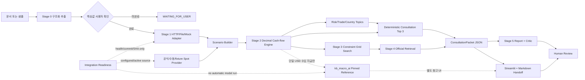

# KBaiAgent Architecture

## 원칙

`KBaiAgent`가 사용자 화면, 사람 확인 gate, 오케스트레이션, 금융 계산, 대응 후보,
공식자료 검색과 보고서를 담당합니다. 팀원의 `kb_macro_ai`는 별도 프로세스로
유지하며 코드를 복사하지 않습니다. 메인 앱은 HTTP 또는 JSON 파일 계약으로
Stage 1을 소비하고, 외부 헤지는 고정 파일 또는 pinned local CLI 결과를 별도
참고 영역에서만 재검증합니다.

## 실제 모듈

| 책임 | 코드 |
| --- | --- |
| 문서 추출·검증·확인 | `src/document_intake/`, `validators.py` |
| Stage 1 원문 검증·정규화 | `src/stage1/web_forecast.py` |
| HTTP/file/mock provider | `src/stage1/forecast_provider.py` |
| Spot provider | `src/stage1/spot_rate.py` |
| 모델·고정 스트레스 시나리오 | `src/stage1/scenario_builder.py` |
| Stage 1+Spot 통합 서비스 | `src/application/market_integration_service.py` |
| Stage 1·Spot·외부 헤지 준비 점검 | `src/application/integration_readiness_service.py`, `scripts/check_integration_readiness.py` |
| 결정론적 환노출·현금 ledger | `src/stage2/` |
| 위험 코드·상담 범주 | `src/consultation/risk_classifier.py`, `response_mapping.py` |
| 결정론 상담 Top 3·숫자 근거 | `src/consultation/prioritization.py` |
| canonical JSON·Markdown handoff | `src/consultation/packet.py` |
| 제약 기반 hedge 후보 | `src/stage3/` |
| 외부 헤지 strict 참고 adapter | `src/application/kb_macro_hedge_service.py` |
| 공식자료 후보 | `src/stage4/` |
| 최소화 JSON 보고서·critic | `src/stage5/` |
| 순서·실패·fallback | `src/workflow/` |
| 사용자 화면 | `app.py`, `src/ui/` |

## Stage 1과 절대환율의 분리

Stage 1 JSON은 방향 점수와 21거래일 최대 상승·하락폭 분위수를 제공합니다. 절대
환율을 임의 추정하지 않습니다. `SpotRateProvider`가 `KRW_PER_1_FX` 기준 절대
환율을 제공해야 `ScenarioBuilder`가 환율 시나리오를 만듭니다.

- 수입: v36 최대 상승폭 q50/q75/q90이 불리한 모델 경로위험입니다.
- 수출: v34 최대 하락폭 q50/q75/q90이 불리한 모델 경로위험입니다.
- v25 방향 점수는 시장 문맥 전용이며 손실 가중치가 아닙니다.
- 결제일이 21거래일 밖이면 모델 시나리오는 문맥에만 남고, Stage 2에는
  ±3/5/10% 고정 스트레스만 전달됩니다.

## 실패 정책

| 실패 | 동작 |
| --- | --- |
| 문서 핵심값 미확인 | 계산 전 차단 |
| Stage 1 HTTP 실패 | file/mock 사용 사실을 `FALLBACK_USED`로 공개 |
| 모든 Stage 1 provider 실패 | Spot이 있으면 고정 스트레스만 사용 |
| Spot 없음·수동값 미확인 | 분석 차단 |
| Stage 2 입력 불일치 | 후속 단계 중단 |
| Stage 3 제약 해 없음 | `NO_FEASIBLE_CANDIDATE`, 상담 필요 |
| 외부 헤지 flag off/미지원/검증 실패 | 기존 Stage 3 유지, 외부 후보 숨김 |
| 상품 공식 근거 없음 | 빈 후보 유지 |
| LLM/critic 실패 | 결정론 템플릿 보고서 |

## 상담 priority와 handoff

상담 topic은 기존 risk finding과 trade/country review need에서만 생성됩니다.
`CATEGORY_PRIORITY_RULES`의 명시적 사전식 rule이 위험 family를 정렬하고 상위
세 개를 `ConsultationPriorityView`로 만듭니다. LLM, 새로운 가중합 위험점수와
공식 후보 score는 rank를 바꾸지 않습니다.

`ConsultationPacket` JSON은 회사 역할·회차·보호수단, Top 3의 numeric rationale와
source path, 부족정보, expected decision, next action, 공식 후보, trace를
보존합니다. Streamlit 카드, Markdown 다운로드와 Stage 5 보고서는 이 JSON에서
파생됩니다. 다운로드는 실제 상담 예약·RM 전송·신청을 수행하지 않습니다.

## 저장과 API

현재는 단일 Streamlit 프로세스이며 DB와 독립 백엔드 API가 없습니다. 사용자 요청의
API endpoint는 서비스 계층 함수로 먼저 구현했습니다. `WorkflowState`는 세션
메모리에 있고 trace는 payload 없이 상태·시간·provider·fallback만 보관합니다.
운영 API 분리는 인증·tenant·감사저장소 설계와 함께 후속 범위입니다.

Stage 1의 외부 모델 결속 계약은
[`STAGE1_INTEGRATION.md`](STAGE1_INTEGRATION.md)를 봅니다.
