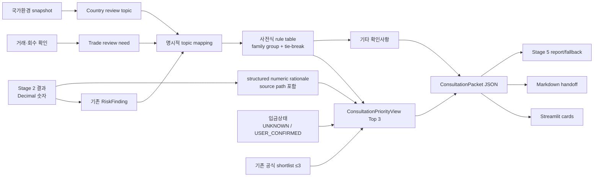

# KBaiAgent 상담 강화 최종 보고서

기준일: 2026-07-29 KST

기준 branch: `feature/submission-benchmark-evidence`

구현 기준 commit: `bb00dc6`까지

검증: API-free unittest 456개, `scripts/verify.py`, 격리 regression PASS

## 1. 결론

현행 상담 기능은 더 이상 위험 유형이나 상품 링크를 insertion order로 나열하는
수준이 아니다. 기존 Stage 2 risk finding, 거래·회수 review need와 국가환경
topic을 명시적 사전식 규칙으로 정렬하고, 상위 세 위험 family를 숫자·부족정보·
기대 결정·다음 행동이 있는 카드로 만든다. Streamlit, Markdown handoff와 Stage 5는
모두 같은 `ConsultationPacket` JSON을 authoritative source로 사용한다.

Golden의 실제 결과는 다음과 같다.

1. 수출대금 회수 보호 상담
2. 환율 관리 상담
3. 운영자금 버퍼·수출대금 회수시점 상담

이 순위는 금융 승인등급·보험 인수등급·대출 심사등급이 아니라 현재 거래에서 먼저
확인할 검토 순서다. LLM은 순위를 생성하거나 재정렬하지 않고, 새로운 가중합
위험점수도 없다 (`src/consultation/prioritization.py:26-137`,
`:761-935`).

상담 품질 점수는 **86/100**이다. 제출용 handoff는 완성됐지만 실제 KB 예약·RM
전송·고객 식별·심사 결과 회수는 구현하지 않았고, 운영 적격성 엔진도 없다.

## 2. 현재 구현

### 2.1 도메인과 canonical packet

기존 `ConsultationTopic`은 그대로 유지한다. 표시·handoff 전용
`ConsultationPriorityView`가 다음 필드를 추가한다
(`src/domain/consultation_models.py:121-158`).

| 필드 | 의미 |
|---|---|
| `rank` | 1~3 검토 순서 |
| `priority_reason` | 어떤 기존 finding과 조건 때문에 앞서는지 |
| `numeric_rationale` | 값·단위·통화·source path가 있는 구조화 근거 |
| `missing_information` | 추측하지 않고 사람 확인이 필요한 사실 |
| `preparation_documents` | 상담 전 준비자료 |
| `bank_questions` | 은행에 확인할 질문 |
| `expected_decision` | 상담에서 확인할 목표, 승인 결론 아님 |
| `next_action` | 사람이 수행할 준비·상담 요청 |
| `official_candidates` | 해당 topic과 연결된 기존 shortlist의 부분집합, 최대 3 |
| `priority_rule_code` | 공개 가능한 결정 규칙 코드 |
| `category_tie_break` | 결정론 tie-break |
| `disclaimer` | 검토 순서와 승인·인수·심사의 분리 |

`ConsultationPacket`에는 회사 역할·회차, 보호수단, Top 3, 기타 topic,
입금상태, 통합 서류·질문, safety boundaries와 trace가 들어간다
(`src/domain/consultation_models.py:161-280`,
`src/consultation/packet.py:819-997`).

### 2.2 위험에서 상담으로 가는 흐름

AI는 위 흐름에서 rank, 숫자, expected decision 또는 next action을 만들지 않는다.
Stage 5에서 선택적으로 자연어를 렌더링할 수 있지만 packet 값을 바꾸지 못하며
실패하면 동일 JSON의 결정론 보고서가 사용된다
(`src/stage5/report_agent.py:23-39`,
`src/stage5/deterministic_fallback.py:217-309`).

## 3. 결정론적 priority rule

`CATEGORY_PRIORITY_RULES`는 `(tier, tie-break, rule code, family)`를 명시한다.
가중합이나 동적 product score를 사용하지 않는다
(`src/consultation/prioritization.py:31-137`).

| 우선 family | 대표 trigger/topic | 정책 |
|---|---|---|
| 지급능력 | `PAYMENT_CAPACITY_RISK` | 실제 지급부족 finding이 있을 때 먼저 확인 |
| 결제·회수 보호 | Open Account, 보호수단 부재, export collection review | Golden의 1순위 |
| 신용장 조건 | trade-risk LC review | 실제 trade need가 있으면 국가 문맥보다 앞섬 |
| 환율 | 열린 노출, FX loss, `LOSS_LIMIT_EXCEEDED` | Golden의 2순위 |
| 유동성 | `LIQUIDITY_BUFFER_RISK` | Golden의 3순위; deficit와 함께 설명 |
| 결제조건·국가 보호 | 해당 review need | 핵심 금융 action 뒤 |
| 정보부족·통상 모니터링 | UNKNOWN/standard monitoring | 후순위 또는 기타 확인 |

같은 family의 topic은 한 카드로 묶는다. 상위 세 family 밖 topic은 삭제하지 않고
`other_consultation_topics`에 둔다 (`prioritization.py:795-935`).
`country_environment` 객체 자체는 priority 계산에서 숫자를 바꾸지 않으며, 이미
생성된 국가 topic만 공개 rule에 따라 후순위로 처리한다 (`:786`).

결정성은
`GoldenConsultationPriorityTests.test_priority_is_independent_of_topic_insertion_order`
가 rank·model dump·fingerprint와 Stage 2 불변을 함께 검증한다.

## 4. 수출 유동성 mapping

수출 거래에서도 기존 `LIQUIDITY_BUFFER_RISK`가
`EXPORT_LIQUIDITY_REVIEW`를 만든다
(`src/consultation/response_mapping.py:548-581`).

문구는 다음 네 값을 함께 보도록 설계됐다.

- `ending_cash`
- `minimum_cash_buffer`
- `maximum_buffer_shortfall`
- `cash_deficit`와 `post_credit_shortfall`

Golden은 -5% ending cash 8,000,000원, 목표 buffer 10,000,000원,
buffer shortfall 2,000,000원이지만 cash deficit와 payment/post-credit deficit는
0원이다. 따라서 “지급불능”, “대출이 반드시 필요”, “필요 대출금 2,000,000원”으로
표현하지 않는다 (`src/consultation/prioritization.py:513-575`,
`:624-637`).

기존 수입 `IMPORT_SETTLEMENT_FINANCE`는 변경하지 않았다.
`DecisionSupportExportTests.test_import_liquidity_mapping_is_unchanged`와
`test_export_liquidity_risk_maps_to_review_topic`이 양방향 회귀를 검증한다.

## 5. 20개 상담 질문 판정

| # | 질문 | 판정 | 근거·한계 |
|---:|---|---|---|
| 1 | 가장 먼저 상담할 문제가 명확한가 | PASS | Top 3 rank와 제목 |
| 2 | 상담 우선순위가 위험 결과와 연결되는가 | PASS | 기존 topic만 primary input |
| 3 | 거래별 숫자가 표시되는가 | PASS | structured rationale + source path |
| 4 | 환율·유동성·결제·국가가 뒤섞이지 않는가 | PASS | family 카드와 기타 확인 분리 |
| 5 | 공식 후보 최대 3개인가 | PASS | model/service 양쪽 max 3 |
| 6 | 후보 선택 이유가 있는가 | PASS | `strategy_connection_reason` |
| 7 | 후보마다 공식 출처가 있는가 | PASS | URL·검증일 포함 |
| 8 | 이용 가능성과 승인을 단정하지 않는가 | PASS | UNKNOWN/CONSULTATION_REQUIRED |
| 9 | 부족정보가 표시되는가 | PASS | Golden 입금상태가 첫 항목 |
| 10 | 상담 준비문서가 제시되는가 | PASS | 카드·통합 packet |
| 11 | 은행 질문이 제시되는가 | PASS | 카드·통합 packet |
| 12 | 기대 결정이 표시되는가 | PASS | 설명형 `expected_decision` |
| 13 | KB 상담 다음 행동이 있는가 | PASS(제한) | 영업점·기업금융·외환 상담 준비, 예약은 없음 |
| 14 | 단순 링크 목록을 넘는가 | PASS | 이유·숫자·서류·질문·행동 |
| 15 | 최종 보고서에도 유지되는가 | PASS | packet source + critic |
| 16 | 데이터 부족을 UNKNOWN으로 처리하는가 | PASS | 입금상태·eligibility |
| 17 | 국가환경이 헤지비율을 바꾸지 않는가 | PASS | integration invariance |
| 18 | eligibility와 위험을 혼동하지 않는가 | PASS | 독립 shortlist |
| 19 | 상담자용 정보 패킷이 있는가 | PASS(제한) | JSON/Markdown, 자동 전송 없음 |
| 20 | 상담 화면만 보고 다음 행동을 고를 수 있는가 | PASS | Top 3 카드와 CTA |

## 6. 상담 점수

| 상담 평가 영역 | 배점 | 점수 | 감점 근거 |
|---|---:|---:|---|
| 위험 기반 우선순위 | 15 | 14 | 공개 rule·결정성은 강함; KB 승인 routing policy는 아님 |
| 거래별 수치와 이유 | 15 | 14 | Golden 핵심값 결속; 모든 generic topic이 풍부한 숫자를 갖는 것은 아님 |
| 상담 유형의 적절성 | 10 | 9 | 결제·FX·유동성 분리; 실제 RM 정책 검증 없음 |
| 공식 후보의 근거 | 10 | 8 | 출처·검증일·이유 존재; 실시간 조건·eligibility 없음 |
| 필요 서류 안내 | 10 | 9 | topic별·중복제거; 실제 심사서류 확정 아님 |
| 상담 질문 안내 | 10 | 9 | actionable하나 상담 결과 회수 없음 |
| 정보 부족과 한계 표시 | 10 | 8 | 핵심 UNKNOWN 표시; 전체 운영데이터 자동 점검은 아님 |
| KB 상담 handoff | 10 | 7 | one-page packet 완성; 예약·RM 전송·고객 매칭 없음 |
| 최종 보고서 연결 | 5 | 5 | 같은 rank·숫자와 fallback |
| UI 가독성과 행동 가능성 | 5 | 3 | Top 3 위계는 명확; 실제 사용자성 테스트와 모바일 실측 부족 |
| **합계** | **100** | **86** | 제출 가능한 상담 준비 경험, 운영 연동은 별도 |

## 7. Golden 상담 패킷

### 공통 거래 snapshot

| 항목 | 값 | source |
|---|---|---|
| 역할·방향 | 한국 판매자 · EXPORT | Stage 0 extraction/confirmation |
| 상대국 | BR | canonicalized buyer country |
| 통화·예정 노출 | USD 100,000 | `stage2.total_foreign_amount` |
| 회차 | USD 20,000 선지급 + USD 80,000 잔금 | Stage 0 installments |
| 잔금일 | 2026-08-20 | Stage 0 installment due date |
| 결제 | Open Account / T/T | trade factor + payment terms |
| Incoterm | FOB Busan, Incoterms 2020 | Stage 0 extraction |
| 보호 | LC·보험·독립 지급보증 없음 확인 | trade-risk snapshot |
| 실제 선지급 입금 | UNKNOWN | consultation payment status |

### 1순위 — 수출대금 회수 보호 상담

- **이유:** Open Account/T/T 잔금과 적용 보호수단 부재,
  `ELEVATED_REVIEW`를 먼저 확인한다. 승인등급이 아니다.
- **숫자:** 예정 수취 USD 100,000, 잔금 USD 80,000, 선지급 예정
  USD 20,000.
- **부족정보 첫 항목:** `USD 20,000 선지급의 실제 입금 여부와 입금일`.
- **준비자료:** 계약서, 인보이스, 선적서류, 입금내역, 거래처 정보와 보호수단 자료.
- **은행 질문:** 현재 채권에 검토 가능한 보험·보증·신용장 또는 결제조건 보강
  구조, 필요서류·비용·심사요건은 무엇인가.
- **기대 결정:** 검토 가능한 보호구조와 필요서류를 확인.
- **다음 행동:** 자료를 준비해 수출대금 회수 보호 상담을 요청.
- **판단하지 않음:** 실제 현재 미수잔액, 구매자 부도확률, 보험 인수·책임금액·
  보험료, 승인 가능성.

### 2순위 — 환율 관리 상담

- **이유:** 열린 예정 USD 노출과 `LOSS_LIMIT_EXCEEDED` finding.
- **숫자:** 예정 수취 USD 100,000, 기준 수취 140,000,000원, -5% 수취
  133,000,000원, 감소 7,000,000원, 허용손실 5,000,000원, 기존 헤지 0,
  보유 USD 0.
- **부족정보:** 실제 은행 환율·spread·fee·한도와 실제 외화·헤지 상태.
- **준비자료:** 수취 일정, 기존 헤지 계약, 외화보유 내역.
- **은행 질문:** 관리할 금액·회차·수단, 실제 환율·비용·한도는 무엇인가.
- **기대 결정:** 관리할 외화금액·회차·수단과 실제 조건을 확인.
- **다음 행동:** 선물환·분할환전·외화예금 상담을 요청.
- **판단하지 않음:** 최적 헤지, 반드시 실행할 비율, 실제 quote·체결 가능성.

### 3순위 — 운영자금 버퍼·수출대금 회수시점 상담

- **이유:** 기존 `LIQUIDITY_BUFFER_RISK`; 지급불능·대출 필요성 판단이 아님.
- **숫자:** -5% ending cash 8,000,000원, 목표 buffer 10,000,000원,
  buffer shortfall 2,000,000원, cash deficit 0원,
  payment/post-credit deficit 0원.
- **부족정보:** 최신 자금계획과 실제 가용 신용한도.
- **준비자료:** 자금계획표, 입출금 일정, 기존 신용한도 자료.
- **은행 질문:** 목표 버퍼를 유지하기 위한 일정 조정 또는 검토 가능한 단기
  유동성 수단과 필요서류는 무엇인가.
- **기대 결정:** 최신 자금계획에서 가능한 일정·수단을 확인.
- **다음 행동:** 운영자금 버퍼 상담을 요청.
- **판단하지 않음:** 지급불능, 필요 대출금 2,000,000원, 실제 한도 0원,
  대출 승인 가능성.

위 값은
`GoldenConsultationPriorityTests.test_golden_numeric_rationale_uses_existing_results`
와 `test_unknown_advance_receipt_is_first_missing_item`이 exact value로 검증한다.

## 8. 부족정보와 사용자 확인

선지급 회차는 계약상 예정액과 실제 이행 상태를 분리한다
(`src/consultation/prioritization.py:177-218`, `:690-729`).

- 미확인: `UNKNOWN`, source `UNCONFIRMED`
- 확인 입금: `CONFIRMED_RECEIVED`, 실제 입금일 필수, source `USER_CONFIRMED`
- 확인 미입금: `CONFIRMED_NOT_RECEIVED`, source `USER_CONFIRMED`

사용자 확인은 해당 missing item과 packet input/priority fingerprint를 갱신하지만
계약상 예정 노출액 또는 기존 Stage 2 계산을 다시 정의하지 않는다.
`test_user_confirmation_removes_only_advance_missing_item`이 이를 검증한다.
missing 목록이 비어도 모든 사실이 확인됐다는 뜻은 아니다.

## 9. one-page handoff 구조

Markdown 첫 페이지와 JSON은 다음 순서를 공유한다
(`src/consultation/packet.py:627-688`).

1. 거래 요약: 역할, 방향, 국가, 통화·예정 노출, 회차·날짜, Incoterm, 결제방식
2. 상담 Top 3: rank, 이유, 숫자, 부족정보, 기대 결정, 다음 행동, 공식 후보
3. 보호수단: LC, 보험, 보증, 기존 헤지, 선지급 실제 입금 상태
4. 준비자료
5. 은행 질문
6. 공식 후보 최대 3
7. 안전 경계
8. trace: document hash, confirmed fields, input/trade/priority fingerprint,
   calculation version, 기준시각, 생성시각

`test_markdown_and_json_use_same_priority_order_and_values`와
`test_handoff_has_safety_boundaries_and_trace`가 JSON/Markdown 결속을 검증한다.

## 10. Streamlit과 Stage 5

상담 영역 상단은 `상담 Top 3` 아래 1·2·3순위 카드를 표시한다
(`app.py:211-307`). 각 카드는 숫자, 부족정보, expected decision, next action,
준비자료·질문·공식 후보를 보여준다. 다운로드 CTA는 실제 예약·RM 전송·신청
완료가 아니라는 caption을 함께 표시한다.

실제 선지급 상태 editor는 `UNKNOWN`, `CONFIRMED_RECEIVED`,
`CONFIRMED_NOT_RECEIVED`만 허용하고 입금 확인에는 날짜를 요구한다
(`app.py:4718-4839`). 이는 상담 packet만 다시 만들고 Stage 2 계산을 변경하지
않는다 (`app.py:321-375`).

Stage 5 deterministic report는 rank·title·priority reason·숫자·부족정보·기대
결정·다음 행동·공식후보·disclaimer를 같은 순서로 출력한다
(`src/stage5/deterministic_fallback.py:217-309`).
`test_stage5_preserves_consultation_top3_order_and_numbers`가 exact order와
7,000,000원·2,000,000원·deficit 0원을 검증한다.

critic은 다음 오표현을 거부한다 (`src/stage5/critic.py:515-590`).

- 상담 순위를 승인·인수·대출 등급으로 표현
- buffer shortfall를 지급불능 또는 대출 필요로 표현
- 예정 노출을 실제 현재 미수·미지급잔액으로 표현
- Stage 3 후보를 최적 추천으로 표현
- 공식 후보를 가입·승인 가능 상품으로 표현
- 국가 raw 값을 KB 국가신용등급으로 표현
- Markdown 다운로드를 RM 전송·예약·신청 완료로 표현

## 11. 공식 후보와 KB CTA

공식 후보는 기존 shortlist와 allow-map만 사용한다. priority는 product score를
읽지 않고 shortlist도 상담 순서를 바꾸지 않는다. 각 후보는 기관·공식명·URL·
검증일·연결 이유를 표시하며 eligibility는 `UNKNOWN`, approval은
`CONSULTATION_REQUIRED`다.

후보가 없으면 임의 상품을 생성하지 않고 다음 경계를 표시한다.

> 현재 검증된 공식 후보가 없습니다. 최신 상담 가능 구조는 KB 영업점 또는
> 기업금융·외환 상담에서 확인하세요.

허용 CTA는 상담 패킷 다운로드, 공식 출처 확인, 영업점 상담 준비다. 실제 상담
예약·RM 전송·신청·내부심사 연동은 없다.

## 12. 남은 약점과 개선안

현행 요청 범위의 P0는 해결됐다. 아래 P0는 로컬 제출 데모가 아니라 실제 고객·
은행 운영으로 전환할 때의 blocker다.

| 우선순위 | 문제 | 사용자 영향 | 현재 근거 | 권장 해결 | 예상 파일/시스템 | 회귀 위험 | 작업량 |
|---|---|---|---|---|---|---|---|
| P0 운영 | 인증·tenant·동의 없음 | 실제 고객 packet 오전달 위험 | 로컬 session only | KB 승인 IAM·동의·보존 계약 선행 | 새 backend/security | 매우 높음 | XL |
| P0 운영 | 악성파일 격리 없음 | 실제 업로드 운영 위험 | 형식·크기만 검사 | AV·sandbox renderer | upload infrastructure | 높음 | L |
| P1 | 처리상태가 로컬 확인뿐 | 상담 진행 여부 추적 불가 | 예약/RM API 없음 | UI에 `다운로드됨/상담 요청 예정` 같은 로컬 비승인 상태만 검토 | domain/app/tests | 중간 | M |
| P1 | 실제 사용자성 근거 부족 | 카드가 실무자에게 긴지 불명 | AppTest 중심 | 기업 담당자·RM 각각 3~5명 과업 테스트 | research/docs | 낮음 | M |
| P1 | official web→shortlist 계약 | live web 후보가 빈 shortlist가 될 수 있음 | 과거 audit finding | category provenance를 보존하는 별도 승인 patch | Stage4/candidate tests | 중간 | M |
| P1 | 발표 화면 자산 | UI 가치 전달이 영상 품질에 의존 | Markdown 대본 중심 | Golden Top 3 캡처·offline 영상 | presentation assets | 낮음 | S |
| P2 | 실제 예약·RM 연동 | 수동 handoff | 명시적 미구현 | 인증·동의 후 KB API adapter | integration/backend | 매우 높음 | XL |
| P2 | 상담 결과 회수 | outcome 학습 불가 | 미구현 | 상담 outcome schema·동의·audit | backend/domain | 높음 | L |
| P2 | 실제 적격성 엔진 | 자격 UNKNOWN 유지 | 의도된 안전 경계 | KB 승인 규칙·최신성·설명가능성 확보 후 별도 엔진 | policy/backend | 매우 높음 | XL |

## 13. 제출 전 최소 권장안

기능 동결 후 새 계산식·상품·eligibility를 추가하지 않는다.

1. Golden Top 3 화면과 packet 다운로드를 3분 데모의 중심으로 둔다.
2. USD 20,000 입금 `UNKNOWN`, USD 100,000 예정 노출, USD 80,000 잔금을
   한 화면에서 구분한다.
3. 2,000,000원 buffer shortfall와 두 deficit 0원을 같은 카드에서 읽는다.
4. 실제 예약·RM 전송이 없음을 CTA 아래와 발표에서 명시한다.
5. 전체 456 tests, verify와 regression 결과를 녹화·제출 체크리스트에 남긴다.

## 14. 테스트 전략과 실행 결과

핵심 신규 테스트는 다음과 같다.

- `tests/test_consultation.py::DecisionSupportExportTests`
- `tests/test_consultation_priority.py::GoldenConsultationPriorityTests`
- `tests/test_stage5_decision_report.py::test_stage5_preserves_consultation_top3_order_and_numbers`
- `tests/test_stage5_decision_report.py::test_critic_rejects_priority_as_approval_grade`
- `tests/test_stage5_decision_report.py::test_critic_rejects_buffer_shortfall_as_insolvency`
- `tests/test_stage5_decision_report.py::test_critic_rejects_scheduled_exposure_as_actual_receivable`
- `tests/test_stage5_decision_report.py::test_critic_rejects_download_as_rm_transfer`
- `tests/test_ui_evidence_state.py::test_export_demo_shows_ranked_consultation_cards_and_cta`
- `tests/test_ui_evidence_state.py::test_golden_packet_ui_marks_advance_receipt_unknown`

실행 결과:

| 명령 | 결과 |
|---|---|
| 상담·Stage 5·UI 집중 4개 모듈 | 67/67 PASS |
| `python -m unittest discover -s tests -v` | 456/456 PASS |
| `python scripts/verify.py` | PASS, 내부 456/456 |
| `python scripts/run_regression.py` | 임시 Git archive에서 PASS |
| compile | PASS |

regression script가 report를 다시 쓰는 특성이 있어 Golden/Baseline 불변 제한을
지키기 위해 원본 worktree가 아닌 임시 archive에서 실행했다.

## 15. 제출 가능한 주장과 금지 주장

제출 가능한 주장:

- 기존 위험 finding 기반 결정론적 상담 Top 3
- 상담별 source path가 있는 숫자·조건 근거
- Golden의 USD 20,000 실제 입금 여부 `UNKNOWN`
- UI·JSON·Markdown·Stage 5의 동일 packet 결속
- 공식 상담 후보 최대 3, eligibility·approval 미확정
- 사용자 확인 전 금융계산 차단
- 제한된 합성문서 1건의 Golden Live 성공
- API-free 456개 테스트와 결정론 fallback

금지 주장:

- AI가 최적 상담·상품을 추천
- 2,000,000원이 필요 대출금 또는 지급불능
- USD 100,000이 실제 현재 미수잔액
- 보험 가입·대출 승인·보증 승인 가능
- Stage 3이 최적 헤지
- BR OECD raw 4가 KB 국가신용등급
- 상담 예약·RM 전송·신청·내부심사 완료
- 모든 문서·실제 고객환경에서 정확함

## 16. 최종 판정

상담 P0/P1의 핵심 제품 gap인 수출 유동성 연결, 결정론 Top 3, 숫자 이유,
입금이력 UNKNOWN, expected decision, next action, one-page handoff와 Stage 5
결속은 완료됐다. 상품 수를 늘리지 않고 기존 분석을 행동 가능하게 만든 점이
현재 구현의 정확한 가치다.

남은 한계는 운영 closure다. 사용자는 무엇을 준비하고 어떤 상담을 먼저 요청할지
결정할 수 있지만, 시스템이 실제 KB 상담을 예약하거나 RM에게 전송하고 심사 결과를
회수하지는 않는다. 따라서 제출 표현은 **“위험 기반 KB 상담 준비 및 handoff
packet”**까지가 정확하다.
