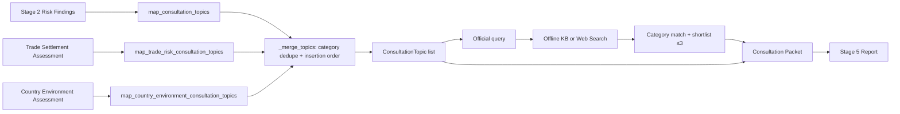

# KBaiAgent 상담 강화 최종 보고서

## 1. 목적과 결론

이 보고서는 “상담 코드가 존재하는가”가 아니라 “기업 사용자가 화면만 보고 어떤
상담을 먼저 준비할지 결정할 수 있는가”를 평가한다.

결론은 다음과 같다.

- 위험→상담 category, 준비서류, 질문, 공식 후보, 다운로드 packet은 실제 구현됐다.
- 공식 후보는 최대 3개이고 출처·선택 이유·자격 미확정 상태를 가진다.
- 그러나 상담 topic에는 `priority/rank`, 거래별 numeric rationale,
  `expected_decision`, 실제 KB handoff action이 없다.
- Golden의 `LIQUIDITY_BUFFER_RISK`는 수출에서 상담 topic으로 매핑되지 않는다.
- Golden의 실제 입금 이력 `UNKNOWN`은 packet `missing_information`에 나타나지 않는다.
- 따라서 현행 상담은 “상품 이름 나열”보다는 낫지만, “위험 기반 1·2·3순위 은행
  상담 준비”에는 미달한다.

엄격한 현재 점수는 **61/100**이다.

## 2. 상담 기능 현재 구현

### 2.1 실제 데이터 구조

`ConsultationTopic`은 다음을 가진다
(`src/domain/consultation_models.py:55-95`).

- category, title
- `triggered_by` risk code
- trade-risk factor/review need
- country rule/review need
- 설명
- 추가로 확인할 정보
- 준비서류
- 은행에 물어볼 질문
- 사람 검토 필수, 최종 판단자
- 선택적 공식 source metadata

갖지 않는 필드는 다음이다.

- `priority`, `rank`, `priority_reason`
- topic별 거래 금액·손실·shortfall snapshot
- `expected_decision`
- `next_action`, 담당 조직, 상담 예약 정보
- 완료 상태·상담 결과

`ConsultationPacket`은 회사/거래 요약, 노출, Stage 2 위험, trade risk, country
environment, topics, shortlist, missing information, 서류, source document SHA,
confirmed fields, input hash와 disclaimer를 묶는다
(`src/consultation/packet.py:541-599`). Markdown과 JSON으로 내려받을 수 있다
(`app.py:4505-4556`).

### 2.2 위험→상담 데이터 흐름



`_merge_topics`는 중복 category의 설명·서류·질문을 합치지만 최초 발견 순서를
유지한다. 위험 severity나 금액을 기준으로 정렬하지 않는다
(`src/application/consultation_service.py:29-78`). 따라서 목록 1번째를 “1순위”라고
부르면 안 된다.

## 3. 현재 잘된 점

다음은 코드·테스트로 확인된 사실이다.

1. 환율, 유동성, 결제·회수, 국가환경이 서로 다른 finding/assessment로 유지된다.
2. 수입 선지급 위험과 수출 회수 위험은 방향별 별도 rule이다.
3. 신용장·보험·보증의 존재를 위험 제거 또는 승인으로 단정하지 않는다.
4. topic마다 준비정보·서류·질문이 실제 존재한다.
5. 공식 후보는 topic category와 official product category가 직접 맞아야 한다.
6. shortlist는 model과 service 양쪽에서 최대 3개로 제한한다
   (`MAX_OFFICIAL_CANDIDATES=3`).
7. 후보마다 공식 URL, 검증일, 연결 이유가 있다.
8. 자격은 `unknown`, 승인은 `consultation_required`다.
9. packet은 문서 SHA·확인 필드·계산 version·input hash를 포함한다.
10. Stage 5 source bundle에 consultation이 유지되고 critic이 후보 이름·기관·URL·
    자격 주장을 검사한다
    (`tests/test_stage5_decision_report.py::test_import_report_contains_trade_risk_and_shortlist`).

이 장점은 “상품 몇 개를 검색해 보여주는 링크 목록”과 구분된다. 다만 다음 장의
약점 때문에 행동 순서가 완성되지는 않았다.

## 4. 20개 질문에 대한 냉정 판정

| # | 질문 | 판정 | 실제 근거 |
|---:|---|---|---|
| 1 | 가장 먼저 상담할 문제가 명확한가? | **FAIL** | priority/rank 없음, insertion order |
| 2 | 상담 우선순위가 위험 결과와 연결되는가? | **PARTIAL** | topic trigger는 연결되나 우선순위 계산 없음 |
| 3 | 필요한 이유가 거래별 숫자로 표시되는가? | **PARTIAL** | packet 상단 전역 숫자는 있으나 topic별 숫자 없음 |
| 4 | 환율·유동성·결제·국가가 뒤섞이지 않는가? | **PASS** | 독립 assessment와 category |
| 5 | 후보 상품/서비스가 최대 3개인가? | **PASS(공식 후보)** | shortlist ≤3; topic 자체는 5~7개 가능 |
| 6 | 후보마다 선택 이유가 있는가? | **PASS** | `strategy_connection_reason` |
| 7 | 후보마다 공식 출처가 있는가? | **PASS** | allowlist URL + verified date |
| 8 | 이용 가능성과 승인을 단정하지 않는가? | **PASS** | unknown/consultation_required |
| 9 | 부족한 정보가 표시되는가? | **PARTIAL** | 일반 gap은 표시, Golden 입금이력 UNKNOWN 누락 |
| 10 | 상담 전 준비문서가 제시되는가? | **PASS** | topic·candidate 문서 목록 |
| 11 | 은행에 물어볼 질문이 제시되는가? | **PASS** | topic별 질문 |
| 12 | 상담 후 기대 결정이 표시되는가? | **FAIL** | expected decision field/문구 없음 |
| 13 | KB 상담으로 이어지는 다음 행동이 있는가? | **PARTIAL** | “사람 상담” 문구와 다운로드뿐, CTA/예약 없음 |
| 14 | 단순 링크 목록에 그치지 않는가? | **PASS** | 숫자·설명·서류·질문·packet 존재 |
| 15 | 상담 결과가 최종 보고서에도 유지되는가? | **PASS** | source bundle·report·critic |
| 16 | 데이터 부족 시 UNKNOWN/추가확인인가? | **PARTIAL** | 대체로 fail-closed, 실제 입금이력 gap 누락 |
| 17 | 국가환경이 헤지비율을 부당하게 바꾸지 않는가? | **PASS** | Stage2/3 불변 integration test |
| 18 | eligibility와 위험분석을 혼동하지 않는가? | **PASS** | 별도 model, eligibility unknown |
| 19 | RM이 넘겨받을 정보 packet이 있는가? | **PARTIAL** | Markdown/JSON은 있으나 rank·role·일정·expected decision 부족 |
| 20 | 상담 화면만 보고 다음 행동을 결정할 수 있는가? | **FAIL** | first action·owner·CTA가 없음 |

## 5. 상담 점수

| 상담 평가 영역 | 배점 | 점수 | 감점 근거 |
|---|---:|---:|---|
| 위험 기반 우선순위 | 15 | 3 | topic은 위험에서 생성되지만 rank가 전혀 없음 |
| 거래별 수치와 이유 | 15 | 8 | 전역 packet 숫자 존재, topic별 binding 없음 |
| 상담 유형의 적절성 | 10 | 8 | 위험 분리는 적절, 수출 liquidity 누락 |
| 공식 후보의 근거 | 10 | 7 | offline은 강함, web-result 통합 결함 |
| 필요 서류 안내 | 10 | 9 | 풍부하나 중복·실제 입금자료 gap 문제 |
| 상담 질문 안내 | 10 | 9 | topic별 질문 구현 |
| 정보 부족과 한계 표시 | 10 | 5 | 안전 disclaimer는 강함, Golden gap 누락 |
| KB 상담 handoff | 10 | 4 | 다운로드만 있고 실제 전달·CTA·담당자 없음 |
| 최종 보고서 연결 | 5 | 5 | packet과 shortlist가 유지됨 |
| UI 가독성과 행동 가능성 | 5 | 3 | expander 위주, 우선순위·한 화면 요약 없음 |
| **합계** | **100** | **61** |  |

61점은 “상담 기능 없음”이 아니라 “상담자료 생성은 작동하지만 우선순위 상담
제품으로는 미완성”이라는 의미다.

## 6. 목표 구조 A~F 대비

| 목표 구조 | 현행 지원 | 판정 |
|---|---|---|
| A. 1·2·3순위와 결정 근거 | topic 생성순서만 존재 | NOT IMPLEMENTED |
| B. 거래별 금액·손실·버퍼·조건 이유 | packet 전역 숫자와 trade factors 분리 | PARTIAL |
| C. 상담 준비자료 | topic·candidate 문서 목록 | COMPLETE |
| D. 은행 질문 | topic별 질문 | COMPLETE |
| E. 공식 후보 ≤3·출처·이유·자격확인 | offline 경로 구현, web 경로 결함 | PARTIAL |
| F. 상담 handoff packet | 거래·노출·위험·topic·후보·trace 존재 | PARTIAL |

### handoff packet 필드별 점검

| 필요한 필드 | 현행 | 비고 |
|---|---|---|
| 거래 요약 | 지원 | trade type/currency/country/date/amount |
| 거래국 | 지원 | 상대국 |
| 회사 역할 | **packet 상단 미지원** | confirmation에는 있으나 `CompanySummary`에 없음 |
| 통화와 예정 노출액 | 지원 | gross/open exposure |
| 지급 일정 | PARTIAL | 대표 settlement date, 회차별 일정은 상단에 없음 |
| 위험 요약 | 지원 | risk codes/findings |
| 환율 stress | 지원 | worst summary와 Stage2 bundle |
| 유동성 결과 | 지원 | buffer/cash/payment gap |
| 결제 보호 현황 | 지원 | trade assessment |
| 상담 우선순위 | 미지원 | topic order만 존재 |
| 필요한 추가정보 | PARTIAL | Golden payment history 누락 |
| 준비자료 | 지원 | deduped list |
| 질문 목록 | 지원 | Markdown에서 topic별 병합 |
| 공식 후보 | 지원 | 최대 3 |
| trace/fingerprint | 지원 | SHA, case, input hash, versions |
| 기대 결정·다음 행동 | 미지원 | 별도 field 없음 |

## 7. Golden 현행 상담 결과 재구성

### 7.1 입력 사실

현행 코드와 committed Golden 자료로 재실행한 값이다.

| 항목 | 값 |
|---|---|
| 판매자/구매자 | 한국 판매자 / 브라질 구매자 |
| 회사 역할/방향 | `SELLER` / `EXPORT` |
| 분석 대상 예정 수취 노출 | USD 100,000 |
| 회차 | USD 20,000 (2026-07-29) + USD 80,000 (2026-08-20) |
| 결제조건 | 20% advance, 80% Open Account/T/T |
| 거래처 관계 | `EXISTING` |
| 신용장/독립 지급보증 | 없음 |
| 보호수단 | `NONE_CONFIRMED` |
| 실제 USD 20,000 입금 여부 | `UNKNOWN` |
| -5% 원화 수취 감소 | 7,000,000원 |
| -5% ending cash / buffer 부족 | 8,000,000원 / 2,000,000원 |
| -10% 수취 감소 / buffer 부족 | 14,000,000원 / 9,000,000원 |
| 현금 적자 / 신용 후 지급 부족 | 0원 / 0원 |
| 거래·회수 review | `ELEVATED_REVIEW` |
| 국가환경 review | `STANDARD_REVIEW` |

### 7.2 현행 코드 topic 순서 — 우선순위 아님

1. `FX_RISK_MANAGEMENT` · 환율 관리 상담
2. `EXPORT_RECEIPT_MANAGEMENT` · 수출대금 회수·환율 관리 상담
3. `EXPORT_RECEIVABLE_PROTECTION` · 수출대금 회수 보호 상담
4. `COUNTRY_MACRO_ENVIRONMENT_MONITORING` · 거시환경 관측자료 확인
5. `TRADE_MARKET_ACCESS_REVIEW` · 통관·관세·시장접근 조건 확인

현행 공식 shortlist:

1. 한국무역보험공사 `단기수출보험 검토`
2. KB국민은행 `수출입기업 외화예금 상담`
3. KB국민은행 `은행 선물환·외환스왑 상담`

이 목록의 1·2·3은 상담 priority가 아니라
`CONSULTATION_PRIORITY`와 candidate score로 정렬한 상품 shortlist다
(`src/application/official_candidate_service.py:147-151`, `:229-239`).

현행 packet의 `missing_information`은 빈 목록이다. 이는 “실제 입금이력이 확인됨”을
뜻하지 않는다. packet builder가 extraction missing field와 trade/country gap만
합치기 때문이다 (`src/consultation/packet.py:510-530`).

## 8. Golden 권장 UX 상담 패킷

아래 1·2·3순위는 **현행 코드가 계산한 순위가 아니다**. 현행 숫자·조건·후보를
사용해 사용자가 행동할 수 있도록 편집한 권장 UX 구조다. 새로운 위험 임계값,
eligibility, 승인 판단을 추가하지 않는다.

### 1순위 상담

- **상담 유형:** 수출대금 회수 보호 상담
- **이 상담이 1순위인 이유:** 잔여 USD 80,000이 Open Account/T/T이고 문서상
  documentary credit와 독립 지급보증이 없으며, 사용자도 적용 보호수단이 없다고
  확인했다. 실제 선지급 입금 여부와 과거 결제이력은 확인되지 않았다. 현행
  거래·회수 rule도 `ELEVATED_REVIEW`와 `RECEIVABLE_PROTECTION_REVIEW`를 낸다.
- **근거 수치:** 예정 수취 노출 USD 100,000, 선지급 예정 USD 20,000, 잔금
  USD 80,000, 잔금일 2026-08-20, 확인된 기간 22일.
- **현재 보호장치:** 적용 가능한 보험·지급보증·보증신용장 없음 확인.
  documentary credit 불필요, 독립 지급보증 미제공. 거래처는 `EXISTING`이다.
- **부족한 정보:** USD 20,000 실제 입금 여부·일자, 수입자 과거 결제이력과
  연체·분쟁, 최신 수입자 정보, 기존 보험/보증의 현재 채권 적용 여부.
- **준비자료:** 최종 수출계약서·인보이스·발주서, 선적서류, 입금내역,
  수출채권 회수 일정, 거래처 정보, 기존 보험·지급보증·보증신용장 문서.
- **은행·기관에 물어볼 질문:**
  - 현재 USD 80,000 Open Account 채권에 검토할 수 있는 회수 보호구조는 무엇인가?
  - 단기수출보험 등 후보의 수출자·수입자·국가·결제기간 요건은 무엇인가?
  - 보상·보증 한도, 면책, 보험료, 사고·연체 통지 의무는 무엇인가?
  - 계약조건을 신용장·보증·분할 회수 구조로 보완할 수 있는가?
  - 신청·심사·증권 발급에 필요한 서류와 기간은 얼마인가?
- **공식 후보:** 한국무역보험공사 `단기수출보험 검토`
  ([공식 출처](https://www.ksure.or.kr/rh-kr/cntnts/i-103/web.do)).
  현행 shortlist의 상담 후보이며 자격·인수·보험료·책임금액은 `UNKNOWN`이다.
- **시스템이 판단하지 않는 사항:** 실제 미수잔액, 수입자 신용등급·부도확률,
  보험 인수·보상 가능성, KB 또는 K-SURE 승인.

### 2순위 상담

- **상담 유형:** 환율 관리 및 수출대금 환전 상담
- **이 상담이 2순위인 이유:** USD 100,000 예정 노출에 fixture 기준 -5%를
  적용하면 원화 수취가 7,000,000원 감소해 사용자 입력 허용손실 5,000,000원을
  넘는다. -10% 조건의 감소는 14,000,000원이다.
- **근거 수치:** 기준 spot fixture 1,400원, -5% 1,330원, 기준 수취
  140,000,000원, -5% 수취 133,000,000원, 감소 7,000,000원.
- **현재 보호장치:** 사용자 입력상 보유 USD 0, 기존 hedge 없음. Stage 3은 기본
  비용가정으로 안정성/균형/비용 3개 계산상 후보를 만들지만 실제 견적이 아니다.
- **부족한 정보:** 실제 USD 20,000 수취 여부, 그에 따른 현재 열린 노출,
  은행 적용 spot/forward rate·spread·fee, 기존 외화계좌·상계 가능 흐름,
  수취일 변경 가능성.
- **준비자료:** 계약서·인보이스, 20/80 수취일정, 실제 입금내역, 외화예금
  잔액, 기존 환헤지 계약, 회사의 손실한도 승인자료.
- **은행에 물어볼 질문:**
  - 현재 열린 노출과 두 회차에 적용 가능한 환율 관리 수단은 무엇인가?
  - 일부 금액·일부 회차만 선물환 또는 분할환전할 수 있는가?
  - 실제 forward rate, spread, fee, 한도와 담보조건은 무엇인가?
  - 외화예금에 수취 후 보유할 경우 비용·환율 위험·운영조건은 무엇인가?
  - 실행에 필요한 기간과 결제일 변경 시 처리방법은 무엇인가?
- **공식 후보:** KB국민은행 `은행 선물환·외환스왑 상담`
  ([공식 출처](https://fx.kbstar.com/quics?page=C110657)),
  `수출입기업 외화예금 상담`
  ([공식 출처](https://img2.kbstar.com/obj/ocommon/kb20210405.pdf)).
- **시스템이 판단하지 않는 사항:** 최적 헤지비율, 실제 가격·한도·담보,
  외화예금 적합성, 손실 회피 보장. Stage 3 비율은 `SIMULATED_CANDIDATE`다.

### 3순위 상담

- **상담 유형:** 운영자금 버퍼·수출대금 회수시점 상담
- **현행 코드 상태:** **수출에는 이 상담 topic이 생성되지 않는다.** 아래는 기존
  Stage 2 결과를 행동 가능하게 만드는 권장 UX이며 구현 완료로 표현하면 안 된다.
- **이 상담이 3순위인 이유:** -5% 조건에서 결제 후 현금 8,000,000원은 목표 버퍼
  10,000,000원보다 2,000,000원 낮다. -10%에서는 9,000,000원 부족이다. 다만
  현금 적자와 신용 후 지급 부족은 모두 0원이므로 “지급불능”으로 표현하지 않는다.
- **근거 수치:** 현재 현금 입력 20,000,000원, 2026-08-20 확정 운영비 입력
  145,000,000원, 신용한도 입력 0원, -5% ending cash 8,000,000원,
  buffer shortfall 2,000,000원.
- **현재 보호장치:** 기준환율에서는 ending cash 15,000,000원으로 buffer를
  유지한다. 입력된 신용한도는 0원이고 실제 한도 조회는 하지 않았다.
- **부족한 정보:** 실제 현재 현금, 확정 운영비의 변동 가능성, USD 20,000 입금
  여부, 실제 가용 신용한도·만기, 8월 20일 전후 원화/외화 입출금.
- **준비자료:** 최신 자금계획표, 계좌·입금내역, 운영비 지급일정, 신용한도·대출
  약정, 회수일정, 기존 금융계약.
- **은행에 물어볼 질문:**
  - 실제 자금계획에서 최소 버퍼를 유지하려면 어느 시점의 조정이 필요한가?
  - 수취일 지연에 대비해 확인할 수 있는 단기 유동성 수단과 필요서류는 무엇인가?
  - 실제 가용한도·금리·만기·담보·심사기간은 무엇인가?
  - 회수조건 분할·앞당김 또는 일부 자금만 지원받는 구조를 검토할 수 있는가?
- **공식 후보:** 현행 shortlist에 이 risk와 직접 연결된 후보는 **없다**.
  임의 상품을 추가하지 말고 KB 상담에서 최신 구조를 확인해야 한다.
- **시스템이 판단하지 않는 사항:** 대출 가능성·한도·금리·승인, 실제 지급능력,
  자금조달 필요액 확정. 2,000,000원은 목표 buffer 기준 부족이지 payment default가
  아니다.

### 보조 검토

BR OECD raw 4, World Bank, WTO는 1·2·3순위의 금융 숫자를 바꾸지 않는 보조
문맥이다. 현행 Golden 국가환경 priority는 `STANDARD_REVIEW`이며,
`PAYMENT_TRANSFER_PROTECTION_REVIEW`가 1순위 회수 보호 질문에 병합된다.
품목 HS code·원산지·실제 관세·통관은 별도 무역전문가 확인사항이다.

## 9. 상담이 약해 보이는 정확한 원인

1. **데이터 모델 원인:** `ConsultationTopic`에 rank와 expected decision이 없다.
2. **정렬 원인:** `_merge_topics`는 위험 크기가 아니라 insertion order를 보존한다.
3. **매핑 원인:** liquidity mapping이 import 전용이다.
4. **표시 원인:** topic card는 risk code를 보여주고 해당 KRW/USD finding을 붙이지 않는다.
5. **정보 gap 원인:** payment history 같은 “문서 밖 사실”을 packet gap으로 넣는
   명시적 수집 경로가 없다.
6. **후보 통합 원인:** official web candidate category가 일반 상수라 상담
   allow-map과 맞지 않는다.
7. **handoff 원인:** 다운로드는 있지만 actual owner, channel, appointment,
   post-consultation decision을 표현하지 않는다.
8. **정보구조 원인:** 4단계 UI에서 여러 topic이 expander로 나열되어 위계가 없다.

## 10. 목표 UI 구조

기존 계산을 바꾸지 않고 presentation view-model만 추가하는 최소 구조다.

```text
┌──────────────────────────────────────────────────────────────┐
│ 먼저 할 일: 1순위 수출대금 회수 보호 상담                  │
│ USD 80,000 Open Account · 보호수단 없음 · 입금이력 UNKNOWN  │
│ [준비자료 6개 보기] [공식 후보 보기] [상담 패킷 다운로드]   │
└──────────────────────────────────────────────────────────────┘

2순위 환율 관리
  -5% 수취 감소 7,000,000원 > 허용손실 5,000,000원
  기대 결정: 관리 대상 금액·회차·수단·실제 비용 확인

3순위 운영자금 버퍼
  -5% 목표 버퍼 부족 2,000,000원 · 실제 지급 부족 0원
  기대 결정: 최신 자금계획과 실제 가용한도 확인

아직 확인할 정보
  □ USD 20,000 실제 입금 여부
  □ 거래처 과거 결제이력
  □ 실제 은행 환율·수수료·한도

상담자에게 전달
  거래요약 + 회차 + 위험숫자 + 보호현황 + 질문 + 공식후보 + fingerprint
```

중요한 구현 원칙:

- 새 위험 점수나 eligibility 계산을 만들지 않는다.
- existing risk findings의 severity·금액·threshold를 표시용으로만 조합한다.
- topic이 3개보다 많으면 상위 3개 뒤에 “기타 확인”으로 접는다.
- priority rule은 공개되고 deterministic이어야 하며 동일 입력에 같은 결과를 내야 한다.
- priority는 “검토 순서”이지 승인·부도·보험인수 등급이 아니다.

## 11. P0/P1/P2 개선안

| 우선순위 | 문제 | 사용자 영향 | 현재 근거 | 권장 해결 | 수정 예상 파일 | 회귀 위험 | 예상 작업량 |
|---|---|---|---|---|---|---|---|
| P0 | `amount_due` 의미 충돌 | 잘못된 현재 미수/예정 노출 | schema `:118`, prompt `:14`, Decision `:453` | 승인 ADR 후 전체 계약 atomic 정렬 | `schemas.py`, prompts, validators, fixtures, UI, docs | 매우 높음 | L, 2~4일 |
| P0 | 수출 liquidity topic 누락 | 2m buffer 부족이 상담에 안 나옴 | mapping `:518-546` | 일반 수출 유동성 topic, 기존 finding만 사용 | response mapping, models, consultation/UI tests | 중간 | S, 0.5~1일 |
| P1 | 1·2·3순위 없음 | 첫 행동 결정 불가 | model/merge | deterministic priority view-model, 공개 이유 | consultation models/service, app, packet/report | 중간 | M, 1~2일 |
| P1 | topic별 숫자 없음 | 왜 필요한지 추상적 | app `:3900-3924` | finding snapshot·threshold를 card에 연결 | consultation service/model, app, tests | 중간 | M, 1일 |
| P1 | 입금이력 UNKNOWN gap 누락 | 실제 노출 오해 | Golden packet `[]` | explicit “실제 이행/입금 이력” gap 추가 | packet/service/UI/Golden tests | 낮음 | S, 0.5일 |
| P1 | expected decision/next action 없음 | 상담 후 목표 불명확 | topic schema | 계산 없는 문구형 field와 owner 추가 | models, mapping, packet, app | 낮음~중간 | M, 1일 |
| P1 | handoff 요약 부족 | RM이 회차·역할 재구성 | CompanySummary | role·회차·top priorities one-page view | models, packet, report, UI | 중간 | M, 1~2일 |
| P1 | official web shortlist 0 가능 | 최신검색 선택 시 빈 결과 | `OFFICIAL_WEB_RESULT` | 검색 결과에 approved product category 보존/검증 | official search/service/tests | 높음 | M, 1~2일 |
| P1 | 실제 KB CTA 없음 | 다운로드 뒤 행동 중단 | app `:4463-4469` | 제출용 연락경로/“영업점 상담 준비” 명확화 | app, docs; 실제 연동은 P2 | 낮음 | S, 0.5일 |
| P1 | Golden split e2e 불일치 | 일정 설명 방어 약함 | app target vs Golden test | 회차 그대로 통합 fixture와 warning assertion | Golden/workflow tests, docs | 중간 | M, 1일 |
| P2 | 상담 예약 | 수동 이동 | 미구현 | 승인된 KB 예약 channel 연동 | 새 backend/integration | 높음 | L |
| P2 | RM 시스템 handoff | 파일 수동 전달 | 미구현 | 인증·동의·tenant 포함 CRM contract | backend/security | 매우 높음 | XL |
| P2 | 신청 가능성 사전 확인 | 자격 UNKNOWN 유지 | 미구현 | 공식 rule/API 계약 후 별도 eligibility engine | 새 domain/API | 매우 높음 | XL |
| P2 | 서류 자동 체크 | 수동 checklist | 미구현 | 업로드 동의·문서별 checklist | intake/domain/UI | 높음 | L |
| P2 | 상담 결과 회수 | 반복 개선 불가 | 미구현 | 상담 outcome schema·consent·audit | backend/domain | 높음 | L |
| P2 | 실제 상품 적합성 엔진 | 후보 수준 | 미구현 | 은행 승인 rule 계약 뒤에만 추진 | internal integrations | 매우 높음 | XL |

## 12. 제출 전 최소 권장안

새 상품·새 점수·새 계산 없이 다음 다섯 가지가 최소다.

1. F-01 `amount_due` 계약을 승인하고 전 계층을 한 commit에서 정렬한다.
2. 수출 liquidity risk가 상담에 나타나는 회귀 테스트와 mapping을 추가한다.
3. 기존 topic을 1·2·3 카드로 표현하고 topic별 기존 숫자·threshold를 붙인다.
4. Golden “USD 20,000 실제 입금 여부 UNKNOWN”을 부족정보 첫 줄에 둔다.
5. Golden split end-to-end와 official web→shortlist 통합 테스트를 추가한다.

실제 예약·RM·eligibility는 제출 직전 범위를 넓히지 말고 명확한 후속 계획으로 남긴다.

## 13. 구현 시 예상 수정 파일

| 목적 | 핵심 파일 | 함께 볼 테스트 |
|---|---|---|
| 금융 의미 계약 | `schemas.py`, `prompts/extraction_rules.md`, `validators.py`, source evidence | schema/validator/recovery/Golden/regression |
| export liquidity mapping | `src/consultation/response_mapping.py` | `tests/test_consultation.py` |
| priority view-model | `src/domain/consultation_models.py`, `src/application/consultation_service.py` | consultation, packet, Stage5 |
| numeric rationale | risk finding/packet adapter, `app.py` | consultation, UI AppTest |
| missing information | `src/consultation/packet.py`, app input/service | Golden, consultation, report |
| official web category | `src/stage4/official_search.py`, official candidate service | Stage4 + official integration |
| handoff rendering | packet model/markdown, `app.py`, deterministic report | packet hash, UI, critic |

## 14. 테스트 전략

수정 후 다음 순서를 지킨다.

1. **Contract tests**: schema/prompt fixture 의미와 문서유형별 amount precedence.
2. **Metamorphic finance tests**: 같은 확인 노출은 표현만 바뀌어도 Stage 2 결과 동일,
   실제 입금 확인 시에만 노출 감소.
3. **Mapping tests**: export+liquidity → 유동성 topic, import 기존 결과 불변.
4. **Priority tests**: 동일 input 동일 1·2·3, 국가 context가 헤지·현금 숫자를
   바꾸지 않음.
5. **Packet tests**: role·회차·missing payment history·numeric reason·hash binding.
6. **Official integration**: mocked web result가 approved category를 거쳐 shortlist에
   연결되고 unofficial/unknown category는 fail-closed.
7. **Golden end-to-end**: 20k/80k split 그대로 Stage1→2→3→trade→country→
   consultation→report.
8. **UI AppTest**: 첫 카드, 세 priority, 부족정보, CTA, eligibility disclaimer.
9. **Critic tests**: priority를 승인등급으로 표현하거나 2m를 지급불능으로 표현하면 거부.
10. 전체 `unittest`, `run_regression.py`, `verify.py`, `git diff --check`.

기대값 완화, 위험 임계값 변경, 후보 수 증가로 테스트를 맞추면 안 된다.

## 15. 하면 안 되는 과장

- 현행 topic 순서를 “AI가 정한 상담 우선순위”라고 부르지 않는다.
- Golden의 USD 20,000을 실제 입금 완료로 말하지 않는다.
- USD 100,000을 실제 현재 미수잔액으로 확정하지 않는다.
- 2,000,000원 buffer shortfall을 지급불능·대출 필요액으로 부르지 않는다.
- BR OECD raw 4를 KB 국가등급·부도확률로 말하지 않는다.
- Stage 3 비율을 최적 헤지·추천·실제 견적으로 말하지 않는다.
- 공식 후보를 가입 가능·승인 가능·보험 인수 가능 상품으로 말하지 않는다.
- Markdown download를 KB RM 시스템 연동이라고 말하지 않는다.
- Golden Live end-to-end 성공이라고 말하지 않는다.
- fixture와 합성 8건을 실제 고객문서 정확도로 일반화하지 않는다.

## 16. 최종 상담 판정

현행 기능은 **“근거 있는 상담 준비자료 생성”은 지원하지만 “위험 기반 1·2·3순위
KB 상담 handoff”는 부분 구현**이다. 가장 효과적인 개선은 상품 수를 늘리는 것이
아니라 이미 계산한 숫자와 부족정보를 첫 행동·서류·질문·기대 결정에 붙이는 것이다.

P0/P1을 최소 범위로 완료하면 사용자는 “무엇이 위험한가”에서 멈추지 않고
“내일 어떤 자료를 들고 어떤 질문을 먼저 할 것인가”까지 결정할 수 있다.
