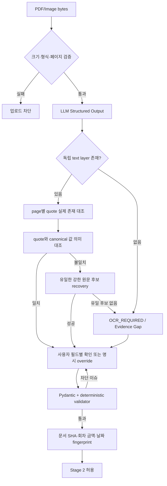
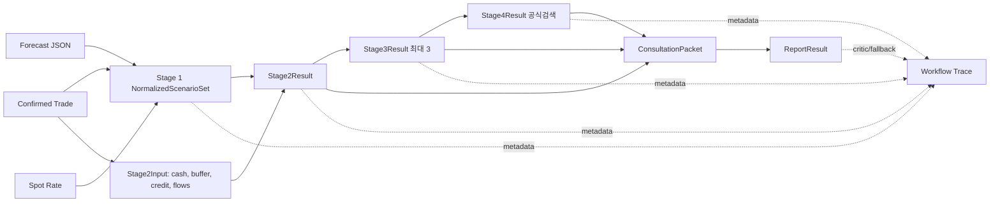
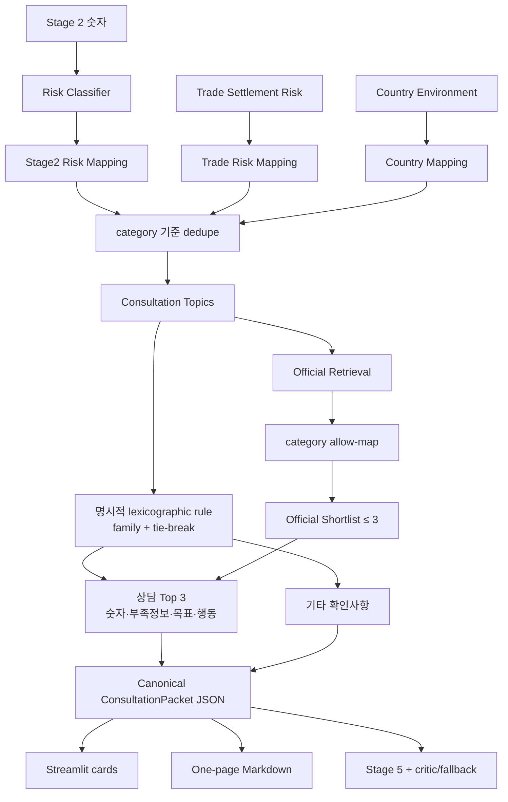
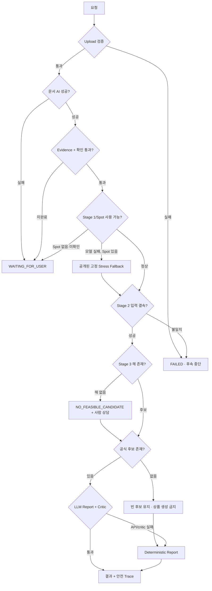

# KBaiAgent 최종 프로젝트 보고서

## 1. 표지 정보

| 항목 | 내용 |
|---|---|
| 프로젝트 | KBaiAgent · 수출입 금융 의사결정 지원 에이전트 |
| 감사 기준일 | 2026-07-29 KST |
| 감사 대상 branch | `feature/submission-benchmark-evidence` |
| 감사 시작 HEAD | `6dd7608eab6bc1be6856e983e28c81e51684e620` |
| 실행 환경 | macOS 26.5.1 arm64 · CPython 3.9.6 |
| 기준 Golden | `dataset/golden_demo/golden_export_contract.pdf` |
| Golden SHA-256 | `5330a1a572488005f7b02cccfc7150fbaa8b38c84bb9290da1e0c6e1c3a0a91c` |
| 감사 방식 | 코드·설정·데이터·UI·문서·테스트·실행 결과 교차 검증 |
| Live API | 이번 감사에서는 호출하지 않음 |
| 문서 성격 | 공모전 제출 전 기술·금융·상담·검증 최종 사실기록 |

## 2. Executive Summary

KBaiAgent는 비정형 무역문서를 구조화한 뒤, 독립 evidence 검증과 사용자 확인을
통과한 값만 `Decimal` 금융 계산으로 전달하고, 환율 스트레스·현금흐름·회수조건·
국가환경을 상담자료로 묶는 Streamlit 기반 MVP다. AI는 문서 구조화와 선택적 설명에
사용되고, 금융 숫자·위험 규칙·후보 제한·critic은 결정론 코드가 통제한다.

현재 강점은 계산 전 확인 gate, text-PDF source-grounded evidence, 스캔형 문서
fail-closed, Stage 1 horizon 구분, Stage 2의 버퍼·현금적자·신용 후 부족 분리,
국가 원자료 비합산, 공식 후보 최대 3개, API-free 456개 회귀 테스트다.
`amount_due`는 승인된 제품 계약상 Stage 2 분석 대상 예정 결제 노출액이고 실제
현재 미수·미지급잔액은 입금·지급 이력 없이는 `UNKNOWN`으로 분리한다.

과거 감사에서 발견한 수출 유동성 상담 누락과 우선순위 handoff gap도 해결됐다.
기존 `LIQUIDITY_BUFFER_RISK`가 수출 운영자금 버퍼 상담을 만들고, 기존 risk
finding과 명시적 category tie-break가 회수 보호 → 환율 → 유동성 Top 3를
결정한다. 각 카드에는 source path가 있는 숫자, 부족정보, 기대 결정, 다음 행동과
공식 후보가 있으며 UI·Markdown·Stage 5는 동일 `ConsultationPacket` JSON에서
파생된다 (`src/consultation/prioritization.py:31-137`, `:761-935`,
`src/consultation/packet.py:819-997`).

상담 순위는 LLM·종합 위험점수·product score가 아니라 검토 순서다. 실제 KB 예약,
RM 전송, 고객 식별, 적격성·승인 판단은 여전히 구현하지 않았다. 현재 코드 기준
종합 평가는 **84/100, 본상 경쟁력 있음**이다. 실제 고객문서 성능·은행 내부
연동·상품 적격성 없이 “대상 경쟁력 있음”을 확정해서는 안 된다. 세부 판정은
[`FINAL_TECHNICAL_AUDIT.md`](FINAL_TECHNICAL_AUDIT.md), 상담 평가는
[`CONSULTATION_STRENGTHENING_REPORT.md`](CONSULTATION_STRENGTHENING_REPORT.md),
실행 순서는 [`FINAL_ACTION_PLAN.md`](FINAL_ACTION_PLAN.md)에 있다.

## 3. 해결하려는 문제

수출입 중소기업은 계약 금액만 알아서는 다음 결정을 내리기 어렵다.

- 보유 외화·확정 유입·기존 헤지를 제외한 열린 환노출이 얼마인지
- 불리한 환율에서 원화 지급액 또는 수취액이 얼마나 변하는지
- 결제·수취 뒤 최소 운영자금이 유지되는지
- Open Account, 선지급, 신용장·보증·보험 부재가 어떤 추가 확인을 요구하는지
- 은행 상담 전에 어떤 서류와 질문을 준비해야 하는지

KBaiAgent는 “환율 예측 정확도”를 주제품으로 삼지 않는다. 확인된 거래와 기업
현금정보를 하나의 의사결정 입력으로 만들고, 숫자와 원문 근거를 잃지 않은 채 사람
상담으로 넘기는 것이 제품의 중심이다 (`README.md:3-22`).

## 4. 대상 사용자

| 사용자 | 현재 지원 | 현재 비지원 |
|---|---|---|
| 수출입 중소기업 재무·자금 담당자 | 문서 확인, 현금·한도 입력, 스트레스 결과, 준비서류·질문 다운로드 | 계좌 자동연결, 실제 잔액·입금이력 조회, 주문 실행 |
| 대표·의사결정자 | 손실·버퍼·부족액과 대응 비교 | 회계·세무 효과, 이사회 승인 workflow |
| KB RM·상담자 | 사용자가 내려받은 Markdown/JSON 상담 패킷 검토 | RM 시스템 수신, 고객 매칭, 상담 예약, 내부 심사 |
| 리스크·QA 담당자 | evidence, fingerprint, source path, trace, deterministic fixture | 중앙 감사저장소, 운영 모니터링, tenant 분리 |

## 5. 서비스 핵심 가치

1. **근거 없는 자동계산 차단**: 모델 값이 맞더라도 원문 근거가 맞지 않으면 Stage 2로
   보내지 않는다 (`validators.py:1400-1432`,
   `tests/test_document_intake_normalization.py::SourceGroundedEvidenceTests`).
2. **금융 의미 분리**: 환손실, 최소 버퍼 부족, 현금 적자, 신용 후 부족을 별도 값으로
   출력한다 (`src/stage2/cashflow.py:112-139`,
   `tests/test_stage2.py::test_buffer_cash_and_credit_shortfalls_are_distinct`).
3. **AI와 계산의 역할 분리**: LLM은 추출·설명에 쓰지만 금융 숫자를 재계산하지 않는다
   (`src/stage5/report_agent.py:23-47`).
4. **행동 준비**: 위험 코드에서 상담 범주·서류·질문·공식 후보를 만든다
   (`src/consultation/response_mapping.py`, `src/consultation/packet.py:541-599`).
5. **과장 억제**: 후보 자격은 `unknown`, 승인은 `consultation_required`이고
   critic이 승인·등급·확률 오표현을 거부한다
   (`src/application/official_candidate_service.py:193-277`,
   `src/stage5/critic.py:144-230`).

## 6. 전체 사용자 흐름

1. 데모 fixture를 선택하거나 PDF·PNG·JPG/JPEG를 업로드한다.
2. AI가 구조화 결과를 만들고 일반 코드가 원문·schema·국가·날짜·금액을 검증한다.
3. 사용자가 역할·거래방향·통화·분석 금액·결제일/분할일정을 확인한다.
4. Stage 1 모델 문맥과 독립 spot으로 모델 경로위험과 고정 stress를 구분한다.
5. 현금·버퍼·신용한도·기존 헤지·원화 현금흐름을 입력해 Stage 2를 계산한다.
6. Stage 3에서 제약을 만족하는 최대 3개 계산상 비교안을 본다.
7. 결제·회수 위험과 BR/US 국가환경을 별도 평가한다.
8. 상담 범주, 공식 후보, 준비서류와 질문을 확인한다.
9. Markdown/JSON 상담 패킷과 선택적 Stage 5 통합 보고서를 내려받는다.

UI는 내부 Stage 0~5를 사용자 업무 기준 네 탭으로 합친다
(`app.py:2031-2044`). 이 단순화는 데모 이해에는 유리하지만, 내부 Stage 번호와 화면
단계가 일치하지 않으므로 발표에서는 “6개 엔진 단계, 4개 사용자 단계”라고 설명해야
한다.

## 7. 시스템 아키텍처

### 7.1 전체 시스템 아키텍처

```mermaid
flowchart LR
    U[기업 사용자]
    UI[Streamlit 4단계 UI]
    GUARD[Upload Guard]
    DOC_AI[Stage 0 문서 구조화 AI]
    EVID[원문 Evidence 검증]
    CONF{사용자 확인 Gate}
    S1A[Stage 1 JSON/REST Adapter]
    MACRO[kb_macro_ai HTTP/File/Mock]
    SPOT[Spot Provider]
    SCEN[모델 경로 + 고정 Stress]
    S2[Stage 2 Decimal Ledger]
    S3[Stage 3 Grid Search]
    TRADE[결제·회수 위험 규칙]
    COUNTRY[BR/US Offline 국가환경]
    MAP[위험 → 상담 범주]
    KB[공식상품 Offline KB]
    WEB[선택적 공식 Web Search AI]
    SHORT[공식 후보 최대 3개]
    PACKET[상담 Packet]
    S5[Stage 5 Report AI]
    CRITIC[Deterministic Critic]
    FALLBACK[Deterministic Report]
    OUT[Markdown / JSON / Trace]

    U --> UI --> GUARD --> DOC_AI --> EVID --> CONF
    CONF -->|미완료·오류| UI
    CONF -->|통과| S1A
    MACRO --> S1A
    SPOT --> SCEN
    S1A --> SCEN --> S2 --> S3
    S2 --> TRADE
    TRADE --> COUNTRY
    S2 --> MAP
    TRADE --> MAP
    COUNTRY --> MAP
    MAP --> KB --> SHORT
    MAP -. 선택 .-> WEB --> SHORT
    S2 --> PACKET
    S3 --> PACKET
    MAP --> PACKET
    SHORT --> PACKET
    PACKET --> S5 --> CRITIC
    CRITIC -->|통과| OUT
    CRITIC -->|1회 수정 후 실패| FALLBACK --> OUT
    S5 -. API 없음·실패 .-> FALLBACK
```



### 7.2 문서 evidence 검증 흐름



AI 출력은 `PARSE`까지만 담당한다. quote 존재·값 일치·recovery·gate·fingerprint는
결정론 코드다 (`src/document_intake/openai_adapter.py:147-170`,
`src/document_intake/source_evidence.py`, `validators.py:1534-1632`).

### 7.3 Stage 1~5 데이터 흐름



### 7.4 위험에서 상담으로 연결되는 흐름



기존 topic merge는 생성과 dedupe만 담당한다. 별도 priority view가 명시적
`CATEGORY_PRIORITY_RULES`로 family를 정렬해 Top 3를 만들므로 collection insertion
order와 LLM 문장에 의존하지 않는다 (`src/consultation/prioritization.py:31-137`,
`:761-935`). 공식 shortlist 최대 3 정책은 유지하며 product score가 상담 rank를
바꾸지 않는다.

### 7.5 오류·fallback·fail-closed 흐름



## 8. 사용 기술 전체 목록

버전은 `requirements.txt`, 실제 interpreter 또는 코드 상수에서 확인했다. 코드에서
확인할 수 없는 것은 `UNKNOWN`으로 적었다.

| 기술 또는 구성요소 | 버전 | 실제 사용 위치 | 역할 | 선택 이유 | 현재 한계 | 근거 파일 |
|---|---|---|---|---|---|---|
| Python / CPython | 3.9.6 | 전체 | 런타임 | 대회 환경·표준 라이브러리 활용 | 3.9 EOL 운영 위험, CI matrix 없음 | 실행 `python --version`, `AGENTS.md` |
| Streamlit | 1.50.0 | `app.py`, `src/ui/` | 단일 프로세스 B2B UI·session state | 빠른 데모와 데이터 위젯 | 인증·tenant·API 분리 없음 | `requirements.txt:1`, `app.py:2031` |
| streamlit-pdf | 1.0.8 | `st.pdf` 문서 미리보기 | PDF 표시 | 앱 안에서 원문 대조 | 브라우저 렌더링 보안 sandbox 아님 | `requirements.txt:2`, `app.py:2138` |
| pandas | 2.3.3 | `app.py` | 표·현금흐름 입력/표시 | Streamlit 표 연동 | 금융 core에는 필요하지 않음 | `requirements.txt:3` |
| OpenAI Python SDK | 2.47.0 | Stage 0, 선택적 Stage 4/5 | structured extraction, web search, 설명 | Pydantic parse·Responses API | 실제 성능은 제한 합성평가뿐, 이번 감사 미호출 | `requirements.txt:4`, `src/document_intake/openai_adapter.py:149` |
| Pydantic | 2.13.4 | `schemas.py`, `src/domain/` | strict 입력·출력 계약 | extra field 거부·검증 일원화 | 하위 호환 필드명이 업무 표시명보다 추상적 | `requirements.txt:5`, `schemas.py:118` |
| python-dotenv | 1.2.1 | 설정 로드 | 로컬 `.env` | 데모 설정 단순화 | 운영 secret manager 아님 | `requirements.txt:6`, `src/config.py` |
| Pillow | 11.3.0 | upload guard, 합성 데이터 | 이미지 검증 | 형식·픽셀 제한 | 악성파일 AV·격리 없음 | `requirements.txt:7`, `src/security/upload_guard.py:83` |
| pypdf | 5.9.0 | upload guard, text evidence | PDF strict parse·text layer | 원문 quote 독립 대조 | OCR·malware sandbox 아님 | `requirements.txt:8`, `src/security/upload_guard.py:59` |
| urllib3 | 1.26.20 | 직접 import 없음; HTTP dependency pin | 하위 HTTP 호환 | 기존 환경 계약 | 실제 코드 직접사용 없음, 2.x가 아닌 오래된 major | `requirements.txt:9`, import scan |
| `decimal.Decimal` | Python 3.9.6 stdlib | Stage 1~3, risk | 금액·환율·비율 계산 | float 오차 회피 | 화면·timeout 등 비금융 값에는 float 존재 | `src/stage2/metrics.py:3-60` |
| `date` / `datetime` | Python 3.9.6 stdlib | validator, provider, trace | 결제일·관측일·감사시각 | 날짜와 timezone 구분 | 휴일 calendar는 Stage 1 fixture 계약에 의존 | `validators.py`, `src/workflow/trace.py` |
| SHA-256 / `hashlib` | Python 3.9.6 stdlib | upload, binding, packet, snapshot | 문서·입력·데이터 무결성 | 결정론 재현·변조 탐지 | 전자서명·중앙 원장 아님 | `src/security/upload_guard.py:160`, `src/stage2/binding.py` |
| JSON / REST adapter | 계약 버전별 | `src/stage1/adapter.py`, `forecast_provider.py` | `kb_macro_ai` 분리 연결 | 팀 모델 재구현 방지 | 실제 sibling 가용성·버전은 저장소 밖이라 UNKNOWN | `docs/STAGE1_CONTRACT.md` |
| `kb_macro_ai` | UNKNOWN | HTTP/file/mock 입력 | 방향 점수·path q50/q75/q90 | 팀 모델 독립 유지 | calibration 없음, 21거래일 중심 | `src/stage1/web_forecast.py`, fixture JSON |
| Manual fixed stress | 규칙 상수 | `src/stage1/scenario_builder.py:15-24` | ±3/5/10% 조건 | horizon 밖에도 명확한 가정 | 예측이 아님 | `tests/test_stage1.py::test_manual_stress_has_seven_points_and_one_base` |
| Stage 2 ledger | `stage2-decimal-1.1` | `src/stage2/` | 노출·현금흐름·유동성 | 결정론·traceable 계산 | 입금이력·계좌 연동 없음 | `src/domain/stage2_models.py`, 실행 결과 |
| Stage 3 grid optimizer | schema 1.0 | `src/stage3/optimizer.py` | 안정성·균형·비용 비교안 | 투명한 5/10% grid | 실제 quote·세무·회계 미반영 | `src/domain/stage3_models.py` |
| 거래·결제 위험 규칙 | `trade-settlement-risk-1.0` | `src/consultation/trade_settlement_risk.py` | 수입 선지급·수출 회수 검토 | 환율 위험과 분리 | 90일은 MVP 기준, 공식 등급 아님 | `src/consultation/trade_settlement_risk.py:15-25` |
| 상담 priority rule | code rule table | `src/consultation/prioritization.py` | 기존 finding을 Top 3 검토 순서로 변환 | LLM·가중합 없이 결정론·감사 가능 | KB 공식 routing policy는 아님 | `src/consultation/prioritization.py:31-137` |
| ConsultationPacket | schema 1.0 | `src/domain/consultation_models.py`, `src/consultation/packet.py` | UI·Markdown·Stage 5 handoff source of truth | rank·숫자·trace 일관성 | 실제 RM 전송·예약 없음 | `src/domain/consultation_models.py:216-280` |
| 국가환경 snapshot | `2026.07.29-v1` | `src/country_environment/`, snapshot | OECD·WB·WTO 별도 문맥 | 원자료 provenance·offline 재현 | BR/US만 지원, IMF 미사용 | `src/country_environment/snapshot.py:13`, snapshot JSON |
| 공식상품 KB | schema 1.0 | `knowledge_base/official_products.json` | 검증 공식 후보 | offline 데모 안정성 | 수동 갱신, 적격성 판단 없음 | `src/stage4/local_kb.py` |
| Official Web Search | SDK/model UNKNOWN at runtime | `src/stage4/official_search.py` | 선택적 공식 도메인 검색 | 최신 공식 페이지 탐색 | 카테고리 통합 결함으로 shortlist 0 가능 | `src/stage4/official_search.py:292-323` |
| Report critic | code version UNKNOWN | `src/stage5/critic.py` | 숫자·source·정책·상품 검수 | LLM 설명 통제 | 자연어 패턴 기반이라 완전 증명 아님 | `tests/test_stage5_decision_report.py` |
| `unittest` | Python 3.9.6 stdlib | `tests/` | API-free 회귀 | 추가 runner 불필요 | coverage 계측·CI 파일 없음 | 456개 실제 실행 |
| Git | 2.47.0 | 전체 | 이력·지문 | 제출 재현 | `.git/index 2`, `index 3` 같은 로컬 메타 백업은 worktree 밖 | `git --version`, `git status`, `git log` |

설치 환경에는 direct 9개를 포함해 `pip freeze` 기준 53개 패키지가 있었고
`python -m pip check`는 `No broken requirements found`였다. 전체 transitive 목록은
기술감사 부록에 기록한다.

## 9. Stage 0~5 상세 설명

### Stage 0 — 문서 인테이크·확인

- 지원: PDF, PNG, JPEG; 15MB, PDF 20쪽, 40M image pixels
  (`src/security/upload_guard.py:14-25`, `:59-165`).
- AI: `responses.parse(..., text_format=TradeDocumentExtraction, store=False)`;
  primary 최대 2회와 다른 fallback 모델 1회, SDK retry 0
  (`src/document_intake/openai_adapter.py:91-170`).
- 결정론: schema, 국가 canonicalization, 금액·날짜, quote/page, 분할합계,
  trade direction, 사용자 확인.
- 차단: evidence 미검증, 핵심값 누락, 확인 불완전, 확인 후 변조.
- 출력: `TradeDocumentExtraction`, `ValidationResult`, `ConfirmationRecord`,
  회차별 `cashflow_events`.

### Stage 1 — 시장 문맥·환율 시나리오

- `kb_macro_ai`는 JSON/REST, file, mock provider로만 연결한다.
- 방향 score는 `probability_calibrated=false`이면 확률이 아니다.
- q90은 최대 경로 변동폭의 분위수이지 “90% 발생확률”이 아니다.
- spot은 한국수출입은행·사용자 확인 manual·fixture 중 별도 공급된다.
- 결제일이 모델 horizon 밖이면 model path를 계산에서 빼고 fixed stress만 사용한다
  (`src/stage1/scenario_builder.py:221-289`).
- provider 실패는 공개된 file/manual fallback으로 격리한다.

### Stage 2 — 환노출·현금흐름·유동성

- 확인된 회차 이벤트를 `Stage2Input`으로 변환하고 문서·거래 fingerprint를 재대조한다.
- 수입은 환율 상승, 수출은 환율 하락을 불리한 방향으로 계산한다.
- 보유 외화, 같은 통화 확정 흐름, 기존 헤지, spread, fee를 반영한다.
- 날짜순 ledger에서 최소잔고, buffer shortfall, 현금 적자, 신용 후 부족을 분리한다.
- 금액은 `Decimal`, 원화 출력은 `ROUND_HALF_UP`, `0.01` quantum이다
  (`src/stage2/metrics.py:3-60`).

### Stage 3 — 환헤지 계산상 후보

- 5% 또는 10% grid에서 forward·staged conversion·unhedged 비율 합 1을 검사한다.
- 허용손실, q90, fixed 10%, 최소 buffer, 신용 후 부족과 비용 가정을 함께 검사한다.
- 안정성·균형·비용 profile별 서로 다른 해를 최대 3개 반환한다.
- 실제 상품 견적·추천·최적 보장이 아니라 `SIMULATED_CANDIDATE`다
  (`src/stage3/optimizer.py:166-549`).

### Stage 4 — 공식 정보와 독립 국가환경

코드의 “Stage 4”는 두 의미가 있으므로 발표에서 구분해야 한다.

- runtime Stage 4: 공식 상품·지원제도 검색 (`src/stage4/`).
- T4 auxiliary: BR/US 국가·무역환경 (`src/country_environment/`).

상품은 official URL allowlist, 거래방향, 상담 category를 통과해야 하며 shortlist는
최대 3개다. 국가환경은 OECD 지급·이전, World Bank 거시관측, WTO 시장접근을
합산하지 않는다. IMF 데이터는 현재 사용하지 않는다. 국가 신호는 Stage 2/3 숫자와
상품 적격성을 바꾸지 않는다
(`tests/test_country_environment_integration.py::test_country_change_does_not_change_cashflow_or_hedge`).

### Stage 5 — 보고서·critic

- 구조화 source bundle만 LLM에 전달하며 raw 문서 evidence text는 제외한다
  (`src/stage5/deterministic_fallback.py:320-390`).
- `store=False`, SDK retry 0, critic 실패 시 최대 1회 재작성이다
  (`src/stage5/report_agent.py:63-66`, `:133-188`).
- 숫자 source path, q90·확률·horizon·뉴스, 거래위험, 국가등급, 상품 URL·자격을
  critic이 검사한다.
- API key 없음, 호출 실패, 후보 없음, critic 재실패는 결정론 보고서로 끝난다.

## 10. AI 사용 지점과 비AI 결정론 로직

| 영역 | AI·외부 모델이 하는 일 | 결정론 코드가 하는 일 | 최종 판단자 |
|---|---|---|---|
| 문서 | 구조화 필드·evidence 후보 생성 | upload, schema, quote/value, 국가·날짜, gate | 사용자 |
| 시장 | 팀 모델이 방향 score·path quantile 제공 | spot 결합, horizon, fixed stress, include/exclude | 코드 + 사용자 spot 확인 |
| 현금흐름 | 사용 안 함 | 모든 금액·날짜 ledger | 코드 |
| 헤지 후보 | 사용 안 함 | grid, 제약, 비용 가정, 최대 3 | 사용자·은행 |
| 거래위험 | 사용 안 함 | 공개 rule table | 사용자·은행 |
| 국가환경 | runtime AI 없음 | committed snapshot, 비합산 rule | 사용자·전문가 |
| 공식 후보 | 선택적 web search만 AI | allowlist, category match, 최대 3, eligibility unknown | 제공기관·은행 |
| 보고서 | 이미 계산된 JSON 설명·1회 수정 | source critic, fallback | 사용자·KB 담당자 |

## 11. 환율 예측과 manual stress

Stage 1 fixture의 방향 값 `down_score=0.712`, `up_score=0.288`은 미보정 score다.
Golden 설명에서 이를 71.2%·28.8% 발생확률로 말하면 안 된다. q90도 경로위험의
분위수다. 고정 stress는 기준 spot에 -10%, -5%, -3%, 0, +3%, +5%, +10%를 적용한
조건 분석이며 예측값이 아니다 (`src/stage1/scenario_builder.py:15-24`).

Golden 분할일정의 현행 app 경로는 첫 회차 2026-07-29를 Stage 1 target으로 택한다
(`app.py:2884-2888`, `src/workflow/orchestrator.py:411-414`). 두 번째 회차
2026-08-20에는 같은 시나리오를 대체 적용했다는 경고가 생긴다
(`src/stage2/engine.py:460-468`). 반면 Golden 테스트는 2026-08-20 하나의
USD 100,000 노출로 scenario를 만들므로 end-to-end 회차 경로와 다르다
(`tests/test_golden_trade_demo.py:282-352`). 고정 stress 손실 숫자는 같지만 model
horizon 설명과 일정 기반 현금흐름 증거는 보강이 필요하다.

## 12. 현금흐름·유동성 계산

Stage 2는 다음을 구분한다.

| 값 | 의미 | Golden -5% |
|---|---|---:|
| 기준 원화 수취 | USD 100,000 × 1,400 | 140,000,000원 |
| stress 원화 수취 | USD 100,000 × 1,330 | 133,000,000원 |
| 수취 감소 | 기준과 stress 차이 | 7,000,000원 |
| ending cash | 현금 + 수취 - 확정 운영비 | 8,000,000원 |
| buffer shortfall | 목표 10,000,000원 미달 | 2,000,000원 |
| cash deficit | 0원 아래 실제 현금 | 0원 |
| post-credit deficit | 신용한도 뒤에도 남는 지급 부족 | 0원 |

이는 `tests/test_golden_trade_demo.py::test_demo_finance_inputs_produce_meaningful_existing_stage2_result`
및 이번 감사의 현행 split-event 재실행 결과와 일치했다.

## 13. 환헤지 후보

현행 Golden 입력에 대한 API-free Stage 3 계산은 최대 3개 비교안을 만든다.

| 관점 | forward | staged | unhedged | 최악손실 | 비용 가정 | 최소현금 |
|---|---:|---:|---:|---:|---:|---:|
| 안정성 | 1.00 | 0.00 | 0.00 | 210,000원 | 210,000원 | 14,790,000원 |
| 균형 | 0.95 | 0.05 | 0.00 | 553,000원 | 203,000원 | 14,447,000원 |
| 비용 | 0.90 | 0.10 | 0.00 | 896,000원 | 196,000원 | 14,104,000원 |

모두 저장소의 기본 bps 가정 아래 제약을 만족한 계산상 후보일 뿐이다. 실제 선물환
환율, 한도, 담보, 수수료, 회계·세무 효과가 없으므로 “추천 비율” 또는 “최적
헤지”라고 부르지 않는다.

## 14. 결제·회수 위험

수입과 수출은 서로 다른 domain rule을 사용한다.

- 수입: 선지급 비율, 신규 거래처, 이행보증·선급금보증 적용 여부.
- 수출: Open Account/D/A, 결제기간, 신규 거래처, 지급보증·수출신용보험·
  보증신용장 적용 여부.
- 신용장은 위험 제거로 취급하지 않고 발행은행·서류조건 확인을 남긴다.
- 보호수단은 존재뿐 아니라 `CONFIRMED_APPLICABLE`이어야 감경한다.
- 90일은 공모전 MVP의 장기조건 검토 경계이며 공식 신용등급 기준이 아니다.

Golden은 기존 거래처, 20% 선지급, USD 80,000 Open Account/T/T 잔금, 22일,
적용 보호수단 없음이므로 거래·회수 위험은 `ELEVATED_REVIEW`다. `HIGH_REVIEW`가
아니다.

## 15. 국가·무역환경

BR/US versioned snapshot만 지원한다. BR은 OECD 공식 raw 4, US는
`HIGH_INCOME_OECD_UNCLASSIFIED` raw null을 보존한다. World Bank의 GDP·물가·
경상수지는 관측연도를 유지하고, WTO 회원·MFN·TPR은 시장접근 확인 문맥으로만
사용한다 (`src/country_environment/assessment.py:165-271`).

Golden은 Open Account 22일이므로 90일 rule이 작동하지 않는다. BR raw 4는 지급·
이전 보호 상담 need만 추가하고 국가환경 priority는 `STANDARD_REVIEW`다
(`src/country_environment/assessment.py:371-390`, `:392-449`). 거래·회수
`ELEVATED_REVIEW`와 국가환경 `STANDARD_REVIEW`를 한 등급처럼 섞어 말하면 안 된다.

## 16. 상담·공식 후보 연결

현행 pipeline은 Stage 2 위험, 거래위험, 국가환경을 각각 상담 topic으로 바꾸고
category 기준으로 합친다. topic에는 설명, 추가 정보, 준비서류, 질문, 사람 검토
필수 상태가 있다 (`src/domain/consultation_models.py:55-95`). 공식 후보는 topic
category와 product category의 allow-map을 통과해야 하며 최대 3개다.

기존 topic을 훼손하지 않고 `ConsultationPriorityView`를 표시·handoff 계층으로
추가했다. 이 view는 rank, priority reason, source path가 있는 numeric rationale,
missing information, 준비자료, 질문, expected decision, next action, 공식 후보와
rule code를 가진다 (`src/domain/consultation_models.py:121-158`).

순서는 `CATEGORY_PRIORITY_RULES`의 `(tier, tie-break, category)`로 결정하며 LLM,
새 가중합 점수와 product score를 사용하지 않는다. 같은 family topic을 묶어
상위 세 개만 Top 3로 만들고 나머지는 `other_consultation_topics`에 보존한다.
Golden은 회수 보호 → 환율 → 유동성 순서다
(`src/consultation/prioritization.py:31-137`, `:761-935`).

offline 후보 연결은 작동하지만, web search 후보는 category가
`OFFICIAL_WEB_RESULT`라 allow-map에 걸리지 않아 shortlist 0건이 될 수 있다는
과거 감사 finding은 남아 있다
(`src/stage4/official_search.py:292-323`,
`src/application/official_candidate_service.py:154-164`). 이 경우 상품을 만들지
않고 빈 후보와 사람 상담 경로를 표시한다.

## 17. Evidence와 사용자 확인

핵심 안전 계약은 다음과 같다.

- 핵심 값마다 정확한 field name의 evidence를 요구한다.
- PDF text layer가 있으면 quote와 page를 실제 원문에서 찾는다.
- quote가 현재 canonical 값과 다른 경우 폐기한다.
- 유일하고 강한 원문 후보에 한해서만 source-grounded recovery를 수행한다.
- textless scan은 `OCR_REQUIRED`, `EVIDENCE_UNVERIFIABLE` 상태로 닫힌다.
- 사용자가 값을 수정하면 이전 model evidence를 폐기한다.
- 명시적 field override는 AI evidence로 위장하지 않고 확인기록에 남긴다.
- 최종 회차 금액·날짜와 문서 SHA를 fingerprint로 Stage 2 입력에 결속한다.

최초 Golden Live v1은 값이 맞았지만 amount/date quote가 틀려 차단됐다. 이후
source-grounded recovery가 적용된 승인된 Golden Live 1건에서
`validation_pass=true`, 사용자 확인 후 `stage2_allowed=true`를 확인했다.
이번 상담 구현·감사에서는 Live API를 다시 호출하지 않았고 단일 합성문서 성공을
전체 문서 정확도로 일반화하지 않는다
(`docs/SUBMISSION_READINESS.md`).

## 18. Fallback과 fail-closed

| 실패 | 현행 처리 | 판정 |
|---|---|---|
| 파일 형식·크기·파싱 오류 | 업로드 차단 | fail-closed |
| 문서 API key 없음/호출 실패 | 실제 업로드를 demo로 바꾸지 않고 오류 | fail-closed |
| evidence/사용자 확인 미완료 | `WAITING_FOR_USER`, Stage 2 미호출 | fail-closed |
| Stage 1 HTTP 실패 | file/mock 또는 manual stress, warning | disclosed fallback |
| spot 없음/수동 미확인 | 계산 차단 | fail-closed |
| model horizon 불일치 | model quantile 계산 제외, fixed stress | disclosed fallback |
| Stage 3 feasible 해 없음 | 빈 후보 + 상담 필요 | no forced advice |
| 공식 검색 실패 | offline KB | disclosed fallback |
| 공식 근거와 topic match 없음 | 빈 shortlist | no invention |
| report API/critic 실패 | deterministic report | safe fallback |

## 19. 보안과 개인정보

현재 MVP는 `.env`, 가상환경, 실제 업로드, live prediction을 Git에서 제외한다.
secret field는 dataclass `repr=False`이고 OpenAI 요청은 `store=False`다. 문서 bytes는
session memory와 API 요청에 존재하지만 자동으로 dataset·log에 저장하지 않는다.
trace는 provider·시간·fallback·source reference만 담는다
(`src/workflow/trace.py:10-58`).

운영 배포에는 아직 다음이 없다.

- 사용자 인증, tenant 격리, 권한·동의·보존·삭제 정책
- AV/malware scanner와 PDF 격리 렌더러
- 중앙 secret manager, rate limit, DLP, SIEM·운영 감사로그
- 서버측 영구저장 여부를 통제하는 배포 아키텍처

따라서 현재 보안 주장은 “로컬 공모전 MVP의 안전 기본값”까지로 제한한다.

## 20. 테스트와 benchmark

2026-07-29 감사에서 직접 실행한 결과다.

| 검증 | 실제 명령 | 결과 |
|---|---|---|
| compile | `PYTHONPYCACHEPREFIX=/tmp/invoice_intake_pycache .venv/bin/python -m compileall -q app.py src scripts tests` | 독립 2회 + verify 내 3회 이상 PASS |
| 전체 suite | `python -m unittest discover -s tests -v` | 상담 변경 후 456/456 PASS |
| release gate | `python scripts/verify.py` | PASS; 내부 456/456 |
| regression | 임시 Git archive에서 `python scripts/run_regression.py` | PASS |
| dependency | `.venv/bin/python -m pip check` | PASS |
| Golden | `python -m unittest -q tests.test_golden_trade_demo` | 14/14 PASS |
| evidence+country alias | 두 모듈 집중 실행 | 26/26 PASS |
| Stage 2·3·4·5 묶음 | `tests.test_stage2 tests.test_stage3_4_5` | 59/59 PASS |
| 상담 priority·handoff | `tests.test_consultation tests.test_consultation_priority` | PASS |
| 상담·거래위험·shortlist | 관련 모듈 집중 실행 | PASS |
| T4 | country unit+integration | 27/27 PASS |
| report/critic·UI | 관련 3개 모듈 | 38/38 PASS |
| Streamlit runtime | API key를 비우고 port 8766, `/_stcore/health` | `ok` |
| import/export CLI | API key를 비우고 `run_decision_demo.py` | 양쪽 PASS |
| local Markdown link | 30개 target 존재 검사 | 0 missing |
| official product URL | 본문 저장 없이 10개 GET status | 10/10 HTTP 200 |
| secret pattern | 고신뢰 credential + generic assignment 분류 | 고신뢰 0, 수동의심 0 |
| `git diff --check` | 현재 worktree | PASS |

`run_regression.py`는 기본 실행만으로 `reports/eval_*`를 쓰므로 Golden/Baseline
불변 제한을 지키기 위해 `git archive HEAD` 임시 사본에서 실행했다. 첫 임시 전개는
잘못된 working directory로 즉시 실패했고, 원본을 명시해 재실행 후 PASS했다. 원본
Baseline은 쓰지 않았다.

테스트 PASS와 제품 완성도는 구분해야 한다. 예를 들어 web search와 offline
shortlist는 각각 테스트되지만 web-result → shortlist 통합 계약은 테스트하지 않아
실제 category 결함이 남아 있다.

## 21. Golden Live 결과

Golden 자료 자체는 합성·비법적 2페이지 text PDF이며 반복생성 byte, exact quote,
KR/BR canonicalization, 20/80 합계, Stage 2 계산을 API-free로 검증한다.

최초 승인된 Live v1 한 건은 OpenAI API 응답 자체는 성공했으나 다음 evidence 오류로
`validation_pass=false`, `stage2_allowed=false`였다.

```text
EVIDENCE_VALUE_MISMATCH: amount_due
EVIDENCE_NOT_IN_SOURCE: explicit_due_date
```

이 기록은 실패를 지우지 않는 historical baseline이다. 이후 source-grounded
recovery가 적용된 승인된 Golden Live 1건에서 `validation_pass=true`, 사용자
확인 후 `stage2_allowed=true`를 확인했다. `demo_inputs.json`의
`live_extraction_executed=false`는 API-free demo input의 provenance이며 이 완료
기록과 다른 목적의 필드다.

제출 표현은 “제한된 합성문서 Golden Live 1건에서 evidence 검증과 사용자 확인 후
Stage 2 허용을 확인”까지다. 전체 문서 정확도, OCR 정확도 100%, 실제 고객환경
검증 완료로 확대하지 않는다. 이번 작업에서는 Live API를 호출하지 않았다.

## 22. 스캔형 Baseline 결과

미국·브라질 합성 scan/image 8건의 Baseline v1/v2는 `gpt-4o-mini` 호출 성공 각
8/8이지만 독립 OCR verifier가 없어 자동 validation과 Stage 2 허용은 각 0/8이다.
v2 국가 canonicalization은 seller_country 8/8, buyer_country 8/8,
trade_type 8/8로 개선됐지만 fixture·합성 8건을 실제 고객분포로 일반화할 수 없다
(`docs/LIVE_BENCHMARK_RESULTS.md`).

accepted evidence coverage 0%는 OCR 정확도 0%가 아니라 “독립 검증해 자동 수용한
evidence가 없음”을 뜻한다. Baseline 실제 비용은 cached input token을 수집하지 않아
`UNKNOWN`이다.

## 23. 알려진 한계

- 분할일정에서 Stage 1 target이 첫 회차로 고정되고 Golden test는 잔금일 단일노출을
  사용한다.
- 공식 web search 결과 category가 shortlist allow-map과 호환되지 않는다.
- 실제 슬라이드/PPTX/Keynote와 최종 녹화본은 저장소 검증 대상이 아니다.
- root/docs architecture, 과거 audit/repositioning 문서가 서로 다른 시점의 사실을
  담으므로 README의 최종 보고서 묶음을 canonical 기준으로 사용해야 한다.
- `src/demo 2.py`, `src/stage5/critic 2.py`, `src/stage5/report_agent 2.py`,
  `docs/PROJECT_BRIEF 2.md`가 canonical 파일과 다른 폐기 후보로 남아 있다.
- 상담 priority는 KB가 승인한 공식 routing policy가 아니라 공개된 MVP rule이다.
- 입금상태 확인은 로컬 session이며 실제 계좌·수납 시스템과 연결되지 않는다.
- 인증·DB·tenant·RM·예약·심사·주문·malware scan·production observability가 없다.
- 실고객 benchmark, 실제 고객환경 검증, 실제 승인/보험인수 예측은 없다.

## 24. 상담 기능 현재 수준

상담 기능은 다음을 실제 지원한다.

- 위험 code → 상담 category
- 거래·결제 위험과 국가환경의 별도 topic
- topic별 설명·추가정보·서류·질문
- 기존 finding 기반 결정론 Top 3와 공개 tie-break
- topic별 숫자·source path·부족정보·기대 결정·다음 행동
- Golden의 USD 20,000 실제 입금 여부 `UNKNOWN`과 사용자 확인 경로
- 공식 출처 후보 최대 3개와 선택 이유
- `eligibility=unknown`, 승인·가격·한도 미확정
- 역할·회차·보호수단·Top 3·문서 SHA·fingerprint를 묶은 one-page Markdown/JSON
- Streamlit·Markdown·Stage 5가 동일 `ConsultationPacket` JSON 사용
- critic이 순위·버퍼·예정노출·최적추천·RM 전송 과장 차단

엄격한 상담 평가는 **86/100**이다. 실제 KB 예약·RM 전송·고객 매칭·상담 결과
회수는 없으므로 handoff는 다운로드까지다. 상세 점수와 Golden packet은 상담 강화
보고서에 있다.

## 25. 향후 개선

제출 전에는 새 상품이나 계산식을 늘리지 않는다.

1. Golden Top 3와 handoff를 중심으로 실제 슬라이드·offline 영상을 완성한다.
2. 공식 web result category 계약은 기능 동결 후 별도 integration patch로 다룬다.
3. 기업 담당자·RM usability test로 카드 길이·질문·서류의 이해도를 확인한다.
4. 운영 전 인증·tenant·동의·보존·삭제·malware scan을 설계한다.
5. 실제 예약·RM adapter와 적격성 엔진은 KB 승인 계약 후 별도 범위로 개발한다.

## 26. 결론

KBaiAgent는 “LLM이 금융 결정을 대신한다”가 아니라 “AI가 문서 입력과 설명을 돕고,
결정론 엔진·evidence gate·상담 priority가 기업과 KB의 다음 대화를 준비한다”로
설명할 때 정확하다. 사용자는 이제 상품 링크 목록이 아니라 회수 보호·환율·
유동성의 검토 순서, 숫자 이유, 부족정보와 다음 행동을 같은 화면에서 확인한다.

현재 판정은 **84/100, 본상 경쟁력 있음**이다. 대상 가능성은 데모 전달력과
상담 handoff의 실무가치를 얼마나 설득하는지에 달렸지만, 실제 고객 검증·KB 내부
연동 없이 “대상 경쟁력 있음”을 확정해서는 안 된다.
